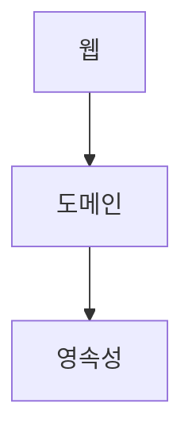
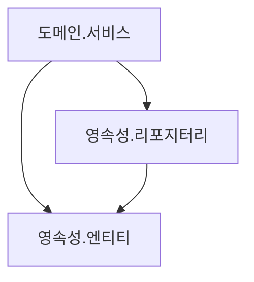
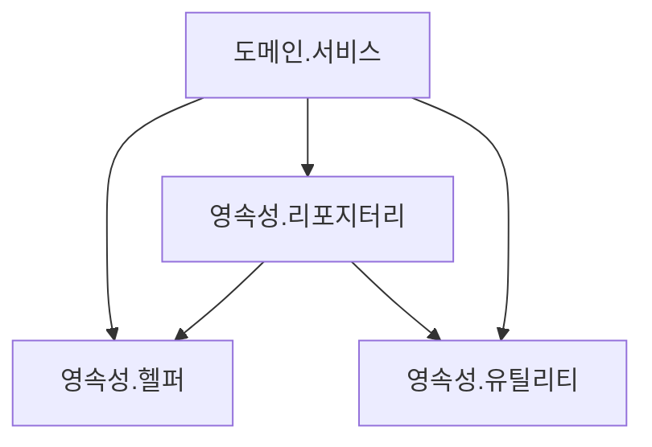
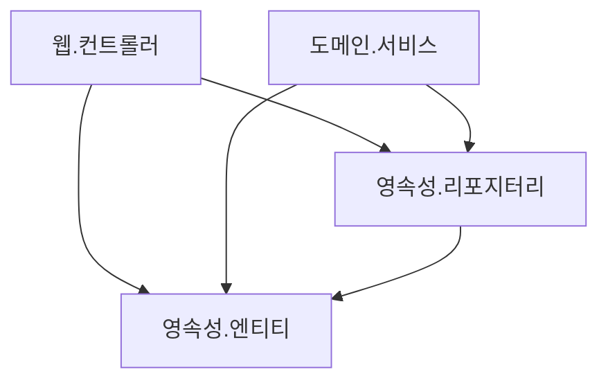
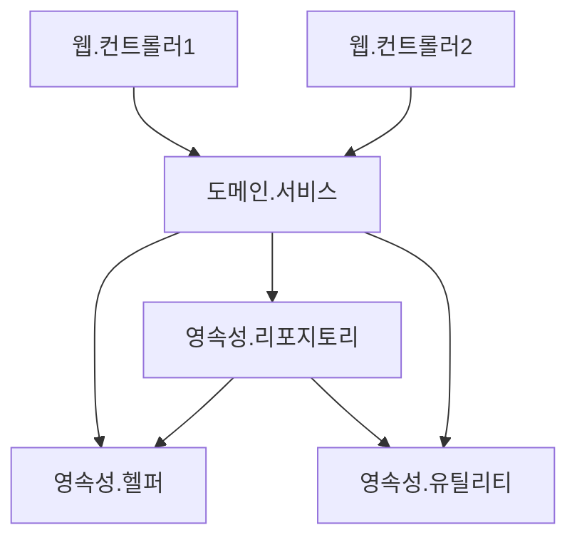
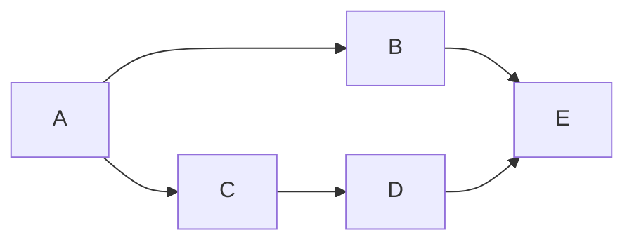
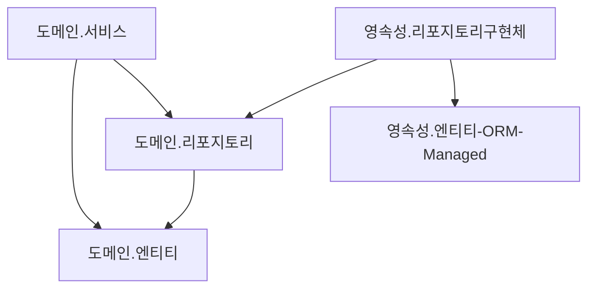

- [1. 계층형 아키텍처의 문제는 무엇일까?](#1-계층형-아키텍처의-문제는-무엇일까)
    - [계층형 아키텍처의 좋은점](#계층형-아키텍처의-좋은점)
    - [계층형 아키텍처의 문제점](#계층형-아키텍처의-문제점)
  - [a. 계층형 아키텍처는 데이터베이스 주도 설계를 유도한다](#a-계층형-아키텍처는-데이터베이스-주도-설계를-유도한다)
    - [모든것이 영속성 계층을 토대로 만들어진다.](#모든것이-영속성-계층을-토대로-만들어진다)
    - [우리가 만드는 애플리케이션의 목적](#우리가-만드는-애플리케이션의-목적)
    - [도메인 로직이 아니라 데이터베이스를 토대로 아키텍처를 만드는 이유](#도메인-로직이-아니라-데이터베이스를-토대로-아키텍처를-만드는-이유)
  - [b. 지름길을 택하기 쉬워진다](#b-지름길을-택하기-쉬워진다)
    - [전통적인 계층형 아키텍처에서는 하나의 규칙만 있다.](#전통적인-계층형-아키텍처에서는-하나의-규칙만-있다)
    - [택하기 쉬운 지름길](#택하기-쉬운-지름길)
    - [지름길을 없애는 방법](#지름길을-없애는-방법)
  - [c. 테스트하기 어려워진다](#c-테스트하기-어려워진다)
    - [계층을 건너 뛰다.](#계층을-건너-뛰다)
    - [계층을 건너 뛰는것의 문제점](#계층을-건너-뛰는것의-문제점)
  - [d. 유스케이스를 숨긴다](#d-유스케이스를-숨긴다)
    - [새로운 유스케이스 조와](#새로운-유스케이스-조와)
    - [계층형 아키텍처의 문제점](#계층형-아키텍처의-문제점-1)
  - [e. 동시 작업이 어려워진다](#e-동시-작업이-어려워진다)
    - [지연되는 소프트웨어 프로젝트에 인력을 더하는 것은 개발을 늦출 뿐이다.](#지연되는-소프트웨어-프로젝트에-인력을-더하는-것은-개발을-늦출-뿐이다)
    - [적절한 규모에서의 인력 추가](#적절한-규모에서의-인력-추가)
    - [계층형 아키텍처의 동시작업](#계층형-아키텍처의-동시작업)
  - [f. 유지보수 가능한 소프트웨어를 만드는 데 어떻게 도움이 될까?](#f-유지보수-가능한-소프트웨어를-만드는-데-어떻게-도움이-될까)
- [2. 의존성 역전하기](#2-의존성-역전하기)
  - [a. 단일 책임 원칙](#a-단일-책임-원칙)
    - [단일 책임 원칙의 오해](#단일-책임-원칙의-오해)
    - [변경할 이유](#변경할-이유)
  - [b. 부수효과에 관한 이야기](#b-부수효과에-관한-이야기)
  - [c. 의존성 역전 원칙](#c-의존성-역전-원칙)
    - [의존성으로 인한 도메인 계층 변경](#의존성으로-인한-도메인-계층-변경)
    - [의존성 역전 원칙](#의존성-역전-원칙)
  - [d. 클린 아키텍처](#d-클린-아키텍처)
    - [클린 아키텍처란](#클린-아키텍처란)
    - [클린 아키텍처의 대가](#클린-아키텍처의-대가)
  - [e. 육각형 아키텍처(헥사고날 아키텍처)](#e-육각형-아키텍처헥사고날-아키텍처)
    - [육각형 아키텍처](#육각형-아키텍처)
    - [육각형 아키텍처를 계층으로 구성](#육각형-아키텍처를-계층으로-구성)
  - [f. 유지보수 가능한 소프트웨어를 만드는 데 어떻게 도움이 될까?](#f-유지보수-가능한-소프트웨어를-만드는-데-어떻게-도움이-될까-1)
- [3. 코드 구성하기](#3-코드-구성하기)
  - [a. 계층으로 구성하기](#a-계층으로-구성하기)
    - [계층으로 코드를 구성하면 기능적인 측면들이 섞이기 쉽다.](#계층으로-코드를-구성하면-기능적인-측면들이-섞이기-쉽다)
  - [b. 기능으로 구성하기](#b-기능으로-구성하기)
    - [기능을 기준으로 코드를 구성하면 기반 아키텍처가 명확하게 보이지 않는다.](#기능을-기준으로-코드를-구성하면-기반-아키텍처가-명확하게-보이지-않는다)
  - [c. 아키텍처적으로 표현력 있는 패키지 구조](#c-아키텍처적으로-표현력-있는-패키지-구조)
    - [아키텍처적으로 표현력 있는 패키지 구조에서는 각 아키텍처 요소들에 정해진 위치가 있다.](#아키텍처적으로-표현력-있는-패키지-구조에서는-각-아키텍처-요소들에-정해진-위치가-있다)
  - [d. 의존성 주입의 역할](#d-의존성-주입의-역할)
    - [웹 컨트롤러가 서비스에 의해 구현된 인커밍 포트를 호출한다. 서비스는 어댑터에 의해 구현된 아웃고잉 포트를 호출한다.](#웹-컨트롤러가-서비스에-의해-구현된-인커밍-포트를-호출한다-서비스는-어댑터에-의해-구현된-아웃고잉-포트를-호출한다)
  - [e. 유지보수 가능한 소프트웨어를 만드는 데 어떻게 도움이 될까?](#e-유지보수-가능한-소프트웨어를-만드는-데-어떻게-도움이-될까)
- [4. 유스케이스 구현하기](#4-유스케이스-구현하기)
  - [a. 도메인 모델 구현하기](#a-도메인-모델-구현하기)
  - [b. 유스케이스 둘러보기](#b-유스케이스-둘러보기)
    - [일반적인 유스케이스](#일반적인-유스케이스)
    - [유스케이스 구현](#유스케이스-구현)
  - [c. 입력 유효성 검증](#c-입력-유효성-검증)
    - [Bean Validation 활용](#bean-validation-활용)
    - [SelfValidating 구현](#selfvalidating-구현)
  - [d. 생성자의 힘](#d-생성자의-힘)
  - [e. 유스케이스마다 다른 입력 모델](#e-유스케이스마다-다른-입력-모델)
  - [f. 비즈니스 규칙 검증하기](#f-비즈니스-규칙-검증하기)
    - [비즈니스 규칙 검증 구현 - 엔티티 속](#비즈니스-규칙-검증-구현---엔티티-속)
    - [비즈니스 규칙 검증 구현 - 엔티티 사용 전](#비즈니스-규칙-검증-구현---엔티티-사용-전)
  - [g. 풍부한 도메인 모델 vs 빈약한 도메인 모델](#g-풍부한-도메인-모델-vs-빈약한-도메인-모델)
  - [h. 유스케이스마다 다른 출력 모델](#h-유스케이스마다-다른-출력-모델)
  - [i. 읽기 전용 유스케이스는 어떨까?](#i-읽기-전용-유스케이스는-어떨까)
  - [j. 유지보수 가능한 소프트웨어를 만드는 데 어떻게 도움이 될까?](#j-유지보수-가능한-소프트웨어를-만드는-데-어떻게-도움이-될까)
- [5. 웹 어댑터 구현하기](#5-웹-어댑터-구현하기)
  - [a. 의존성 역전](#a-의존성-역전)
  - [b. 웹 어댑터의 책임](#b-웹-어댑터의-책임)
    - [웹 어댑터의 일반적인 일 처리](#웹-어댑터의-일반적인-일-처리)
    - [웹 어댑터 일처리의 상세 내용](#웹-어댑터-일처리의-상세-내용)
    - [웹 어댑터의 책임](#웹-어댑터의-책임)
  - [c. 컨트롤러 나누기](#c-컨트롤러-나누기)
  - [d. 유지보수 가능한 소프트웨어를 만드는 데 어떻게 도움이 될까?](#d-유지보수-가능한-소프트웨어를-만드는-데-어떻게-도움이-될까)
- [6. 영속성 어댑터 구현하기](#6-영속성-어댑터-구현하기)
  - [a. 의존성 역전](#a-의존성-역전-1)
    - [코어의 서비스가 영속성 어댑터에 접근하기 위해 포트를 사용한다.](#코어의-서비스가-영속성-어댑터에-접근하기-위해-포트를-사용한다)
  - [b. 영속성 어댑터의 책임](#b-영속성-어댑터의-책임)
    - [영속성 어댑터의 일반적으로 하는 일](#영속성-어댑터의-일반적으로-하는-일)
    - [영속성 어댑터의 구체적으로 하는 일](#영속성-어댑터의-구체적으로-하는-일)
  - [c. 포트 인터페이스 나누기](#c-포트-인터페이스-나누기)
    - [하나의 아웃고잉 포트 인터페이스에 모든 데이터베이스 연산을 모아두면 모든 서비스가 실제로는 필요하지 않은 메서드에 의존하게 된다.](#하나의-아웃고잉-포트-인터페이스에-모든-데이터베이스-연산을-모아두면-모든-서비스가-실제로는-필요하지-않은-메서드에-의존하게-된다)
    - [로버트 C. 마틴: 필요없는 화물을 운반하는 무언가에 의존하고 있으면 예상하지 못했던 문제가 생길 수 있다.](#로버트-c-마틴-필요없는-화물을-운반하는-무언가에-의존하고-있으면-예상하지-못했던-문제가-생길-수-있다)
    - [아웃고잉 포트에 ISP를 적용](#아웃고잉-포트에-isp를-적용)
  - [d. 영속성 어댑터 나누기](#d-영속성-어댑터-나누기)
    - [도메인 클래스 하나 <--> 영속성 어댑터 하나 구현](#도메인-클래스-하나----영속성-어댑터-하나-구현)
    - [바운디드 컨텍스트의 영속성 요구사항을 분리](#바운디드-컨텍스트의-영속성-요구사항을-분리)
  - [e. 스프링 데이터 JPA 예제](#e-스프링-데이터-jpa-예제)
    - [Account Entity](#account-entity)
    - [Account ORM Entity](#account-orm-entity)
    - [Activity ORM Entity](#activity-orm-entity)
    - [Account JpaRepository](#account-jparepository)
    - [Activity JpaRepository](#activity-jparepository)
  - [f. 데이터베이스 트랜잭션은 어떻게 해야 할까?](#f-데이터베이스-트랜잭션은-어떻게-해야-할까)
  - [g. 유지보수 가능한 소프트웨어를 만드는 데 어떻게 도움이 될까?](#g-유지보수-가능한-소프트웨어를-만드는-데-어떻게-도움이-될까)
- [7. 아키텍처 요소 테스트하기](#7-아키텍처-요소-테스트하기)
  - [a. 테스트 피라미드](#a-테스트-피라미드)
    - [비용이 많이 드는 테스트는 지양하고 비용이 적게 드는 테스트를 많이 만들어야 한다.](#비용이-많이-드는-테스트는-지양하고-비용이-적게-드는-테스트를-많이-만들어야-한다)
  - [b. 단위 테스트로 도메인 엔티티 테스트하기](#b-단위-테스트로-도메인-엔티티-테스트하기)
  - [c. 단위 테스트로 유스케이스 테스트하기](#c-단위-테스트로-유스케이스-테스트하기)
  - [d. 통합 테스트로 웹 어댑터 테스트하기](#d-통합-테스트로-웹-어댑터-테스트하기)
  - [e. 통합 테스트로 영속성 어댑터 테스트하기](#e-통합-테스트로-영속성-어댑터-테스트하기)
  - [f. 시스템 테스트로 주요 경로 테스트하기](#f-시스템-테스트로-주요-경로-테스트하기)
  - [g. 얼마만큼의 테스트가 충분할까?](#g-얼마만큼의-테스트가-충분할까)
  - [h. 유지보수 가능한 소프트웨어를 만드는 데 어떻게 도움이 될까?](#h-유지보수-가능한-소프트웨어를-만드는-데-어떻게-도움이-될까)
- [8. 경계 간 매핑하기](#8-경계-간-매핑하기)
- [9. 애플리케이션 조립하기](#9-애플리케이션-조립하기)
- [10. 아키텍처 경계 강제하기](#10-아키텍처-경계-강제하기)
- [11. 의식적으로 지름길 상요하기](#11-의식적으로-지름길-상요하기)
- [12. 아키텍처 스타일 결정하기](#12-아키텍처-스타일-결정하기)


# 1. 계층형 아키텍처의 문제는 무엇일까?


- 위의 그림은 일반적인 3계층 아키텍처이다.
- 웹계층
  - 요청을 받아 도메인 or 비즈니스 계층에 있는 서비스로 요청 
- 도메인 혹은 서비스
  - 필요한 비즈니스 로직을 수행하고
  - 도메인 엔티티의 현재 상태를 조회하거나 변경하기 위해 영속성 계층의 컴포넌트를 호출 

### 계층형 아키텍처의 좋은점 
- 계층을 잘 이해하고 구성한다면 웹계층이나 영속성 계층에 독립적으로 도메인 로직을 작성할 수 있다.
- 도메인 로직에 영향을 주지 않고 웹 계층과 영속성 계층에 사용된 기술을 변경할 수 있다.
- 기존 기능에 영향을 주지 않고 새로운 기능을 추가할 수 있다. 
- 잘 만들면 선택의 폭을 넓히고, 변화하는 요구사항과 외부 요인에 빠르게 적응할 수 있다. 

### 계층형 아키텍처의 문제점 
- 코드에 나쁜 습관들이 스며들기 쉽다.
- 시간이 지날수록 소프트웨어를 점점 더 변경하기 어렵게 만드는 많은 허점들을 노출한다.


## a. 계층형 아키텍처는 데이터베이스 주도 설계를 유도한다

### 모든것이 영속성 계층을 토대로 만들어진다.
- 전통적인 계층형 아키텍처의 토대는 DB이다.
- 웹 계층은 도메인 계층에 의존하고, 도메인 계층은 영속성 계층에 의존하기 때문에 자연스럽게 데이터베이스에 의존한다.

### 우리가 만드는 애플리케이션의 목적 
- 비즈니스를 관장하는 규칙이나 정책을 반영한 모델을 만들어서 사용자가 이러한 규칙과 정책을 더욱 편리하게 활용할 수 있게 한다. 
- 상태(state)가 아니라 행동(behavior)을 중심으로 모델링한다.
- 행동이 상태를 바꾸는 주체이기 때문에 행동이 비즈니스를 이끌어간다. 

### 도메인 로직이 아니라 데이터베이스를 토대로 아키텍처를 만드는 이유 
- 계층형 아키텍처에서는 의존성 방향에 따라 자연스럽게 데이터베이스의 구조를 먼저 생각하고, 이를 토대로 도메인 로직을 구현한다.
  - 이 구현 방법은 비즈니스 관점에서는 맞지 않는 방법이다.
  - 도메인 로직을 먼저 만들고, 로직을 제대로 이해 했는지 확인한 후에 이를 기반으로 영속성 계층과 웹 계층을 만들어야 한다.
- 가장 큰 이유는, ORM 프레임워크를 사용하기 때문이다.
  - 계층형 + ORM 프레임워크 결합은 비즈니스 규칙을 영속성 관점과 섞고 싶은 유혹을 쉽게 받는다.


- ORM에 의해 관리되는 엔티티들은 일반적으로 영속성 계층에 둔다.
  - 계층은 아래방향으로만 접근 가능하기 때문에 도메인 계층에서는 이러한 엔티티에 접근할 수 있다.
  - 그리고, 이러한 엔티티에 접근할 수 있다면 분명 사용되기 마련이다.
- 하지만, 이렇게 구성되면 영속성 계층과 도메인 계층 사이에 강한 결합이 생긴다.
  - 서비스는 영속성 모델을 비즈니스 모델처럼 사용하게 되고 
  - 이로 인해 도메인 로직 뿐만 아니라 즉시 로딩/지연 로딩, 데이터베이스 트랜잭션, 캐시 플러시 등 영속성 계층과 관련된 작업들을 해야 한다. 
- 영속성 코드가 사실상 도메인 코드에 녹아들어서 둘 중 하나만 바꾸는 것이 어려워 진다.
  - 유연하고 선택의 폭을 넓혀준다던 계층형 아키텍처의 목표와 정확히 반대되는 상황이다.


## b. 지름길을 택하기 쉬워진다

### 전통적인 계층형 아키텍처에서는 하나의 규칙만 있다.
- 특정 계층에서 같은 계층 또는 아래에 있는 계층에만 접근 가능하다.
- 위의 규칙 이외에는 아키텍처에서의 강제성은 없다.

### 택하기 쉬운 지름길
- 상위 계층에 접근해야 하는 경우, 그 컴포넌트를 내리면 그만이다.
- 한번이 어렵지, 유혹을 뿌리치기가 쉽지 않다.


- 영속성 계층에서는 모든 것에 접근이 가능하기 떄문에 시간이 지나면서 점점 비대해진다.
- 수년에 걸친 개발과 유지보수로 결국 위의 그림으로 될 확률이 높다.

### 지름길을 없애는 방법 
- 규칙이 깨졌을 때 빌드가 실패하도록 만드는 규칙이 필요하다.
- 위와 같은 규칙이 없다면 계층형 아키텍처는 최선의 선택이 아니다. 
- 시니어 개발자가 코드 리뷰를 한다고 해도 의미는 없다. 


## c. 테스트하기 어려워진다

### 계층을 건너 뛰다.
- 엔티티의 필드를 단 하나만 조작하면 되는 경우에 웹 계층에서 바로 영속성 계층에 접근하면 도메인 계층을 건드릴 필요가 없지 않을까? 란 생각이 종종 든다.


- 처음 몇번은 괜찮게 느껴지지만, 이런일이 자주 발생하면 두가지 문제점이 생긴다.

### 계층을 건너 뛰는것의 문제점 
1. 단하나의 필드를 조작하는 것에 불과 하더라도 도메인 로직을 웹 계층에 구현하게 된다. 
   - 만약 유스케이스가 확장된다면 어떻게 될까? 
   - 더 많은 도메인 로직을 웹 계층에 추가해서 어플리케이션 전반에 걸쳐 책임이 섞이고 핵심 도메인 로직들이 퍼져나갈 확률이 높다 
2. 웹 계층 테스트에서 도메인 계층뿐만 아니라 영속성 계층도 모킹해야 한다.
   - 테스트의 복잡도가 올라간다.
   - 테스트 설정이 복잡해짐으로써 테스트를 전혀 작성하지 않는 방향으로 가는 첫 걸음이다. (복잡한 설정을 할 시간이 없기 떄문)
   - 컴포넌트의 규모가 커지면 테스트 코드를 작성하는 것보다 종속성을 이해하고 목을 만드는데 더 많은 시간이 걸린다. 

## d. 유스케이스를 숨긴다

### 새로운 유스케이스 조와
- 개발자들은 새로운 유스케이스를 구현하는 새로운 코드를 짜는 것을 좋아한다.
- 그러나, 실제로는 기존 코드를 바꾸는 데 더 많은 시간을 쓴다.
- 레거시 프로젝트에만 해당 되는 것이 아니라, 신규 프로젝트에서도 해당이 되는 이야기이다.
- 기능을 추가하거나 변경할 적절한 위치를 찾는일이 많기 떄문에 아키텍처는 코드를 빠르게 탐색하는데 도움이 돼야 한다.
- 이런 관점에서 계층형 아키텍처의 문제는 무엇일까?

### 계층형 아키텍처의 문제점
- 계층형 아키텍처는 도메인 로직이 여러 계층에 걸쳐 흩어지기 쉽다.
  - 유스케이스가 간단해서 도메인 계층을 생략한다면 웹 계층에 존재할 수도 있고,
  - 도메인 계층과 영속성 계층 모두에서 접근할 수 있도록 특정 컴포넌트를 아래로 내렸다면 영속성 계층에 존재할 수도 있다
  - 이럴 경우 새로운 기능을 추가할 적당한 위치를 찾는 일은 이미 어려워 진다.


- 계층형 아키텍처는 도메인 서비스의 너비에 관한 규칙을 강제하지 않는다.
  - 시간이 지날수록 여러개의 유스케이스를 담당하는 아주 넓은 도메인 서비스가 만들어지기도 한다
  - 넓은 서비스는 영속성 계층에 많은 의존성을 갖게 되고, 다시 웹 레이어의 많은 컴포넌트가 이 서비스에 의존하게 된다.
  - 그럼 서비스를 테스트하기도 어려워지고 작업해야 할 유스케이스를 책임지는 서비스를 찾기도 어려워진다.
- 고도로 특화된 좁은 도메인 서비스가 유스케이스 하나씩만 담당하게 된다면 어떨까?
  - UserService에서 사용자 등록 유스케이스를 찾는 대신 
  - RegisterUserService를 바로 열어서 작업을 시작하면 유스케이스를 책임지는 서비스를 찾기가 수월해진다.

## e. 동시 작업이 어려워진다

### 지연되는 소프트웨어 프로젝트에 인력을 더하는 것은 개발을 늦출 뿐이다.
- 지연되지 않은 소프트웨어 프로젝트에 대해서도 마찬가지다.
- 모든 상황에서 50명 정도의 큰 규모의 개발팀이 10명 정도 되는 작은 규모의 개발 팀 보다 5배 빠를거라고 기대할 수 없다.
- 여러 하위팀으로 쪼개서 각기 분리된 파트를 개발할 수 있는 아주 규모가 큰 애플리케이션을 만들고 있다면 그럴 수도 있지만, 대부분은 서로 도움을 주고 받으며 개발해야 한다

### 적절한 규모에서의 인력 추가
- 적절한 규모에서는 프로젝트에 인원이 더 투입될 경우 확실히 더 빨라지지만, 이것도 아키텍처가 동시 작업을 지원해야 한다.
- 그 아키텍처가 계층형 아키텍처는 아니다.

### 계층형 아키텍처의 동시작업
- 새로운 유스케이스를 추가할 때 
  - 개발자가 3명이 있다.
  - 한명은 웹 계층, 한명은 도메인 계층, 한명은 영속성 계층에 기능을 추가한다고 상상해보자.
- 계층형 아키텍처에서는 하나의 유스케이스를 동시작업을 할 수 없다.
  - 모든 것이 영속성 게층 위에 만들어지기 떄문에 영속성 계층을 먼저 개발해야 하고, 그다음 도메인 계층, 그다음 웹계층을 만들어야 한다.
  - 그렇기 때문에 특정 기능은 동시에 한명의 개발자만 작업할 수 있다.
- 인터페이스를 먼저 같이 정의하고, 구현을 기다릴 필요 없이 인터페이스로 작업하면 될까?
  - 데이터베이스 주도 설계를 하지 않는 경우에만 가능하다.
  - 데이터베이스 주도 설계는 영속성 로직이 도메인 로직과 뒤섞여서 각 측면을 개별적으로 작업할 수 없다
- 코드에 넓은 서비스가 있다면 서로 다른 기능을 동시에 작업하기가 더욱 어렵다
  - 서로 다른 유스케이스에 대한 작업을 하게 되면 같은 서비스를 동시에 편집하는 상황이 발생하고, 
  - 이는 병합 충돌과 잠재적으로 이전 코드로 되돌려야 하는 문제가 생긴다.

## f. 유지보수 가능한 소프트웨어를 만드는 데 어떻게 도움이 될까? 
- 올바르게 구축하고 몇 가지 추가적인 규칙들을 적용하면 계층형 아키텍처는 유지보수에 적합할 수 있다.
- 하지만, 많은 것들이 잘못된 방향으로 흘러가도록 용인한다.
- 아주 엄격한 자기 훈련 없이는 시간이 지날수록 품질이 저하되고 유지보수하기가 어려워지기 쉽다
- 어느 아키텍처로 만들던, 게층형 아키텍처의 함정을 염두에 두고 지름길을 택하지 않으면 유지보수하기 적합한 소프트웨어가 만들어질 수 있다.

# 2. 의존성 역전하기

- 1장에서는 계층형 아키텍처의 단점만 늘어놓았고, 이번엔 대안에 대해서 이야기 해보자.

## a. 단일 책임 원칙

### 단일 책임 원칙의 오해
- `단일 책임의 원칙하나의 컴포넌트는 오로지 한 가지 일만 해야 하고, 그것을 올바르게 수행해야 한다`
- 위의 해석은 단일 책임이라는 말을 가장 직관적으로 해석한것이고, 실제 정의는 아래와 같다.
- `컴포넌트를 변경하는 이유는 오직 하나뿐이어야 한다.`
- 컴포넌트를 변경할 이유가 한 가지라면 다른 이유로 소프트웨어를 변경하더라도 이 컴포넌트에 대해서는 신경쓸 필요가 없어진다.

### 변경할 이유 
- 변경할 이유는 컴포넌트 간의 의존성을 통해 쉽게 전파된다.


- 위 그림에서는 A -> E, A -> D 는 직접적으로 연결되진 않았지만, 간접적으로 의존하고 있고 이것을 전이 의존성이라고 한다.
- 컴포넌트 A는 다른 컴포넌트에 모두 의존하고 있지만, E는 의존하는것이 전혀 없다.
- 컴포넌트 E를 변경할 유일한 이유는 새로운 요구사항에 의해 E의 기능을 바꿔야 할 때 뿐이다.
- 반면 컴포넌트 A의 경우에는 모든 컴포넌트에 의존하고 있기 때문에 다른 어떤 컴포넌트가 바뀌든지 같이 바뀌어야 한다.
- 많은 코드가 단일 책임 원칙을 위반하기 때문에 시간이 갈수록 변경하기가 더 어려워지고 변경 비용도 증가한다.
  - 시간이 갈수록 컴포넌트를 변경할 이유가 더 많아진다.
  - 변경할 이유가 많아지면 한 컴포넌트를 바꾸는 것이 다른 컴포넌트가 실패하는 원인으로 작용할 수 있다. 

## b. 부수효과에 관한 이야기

저자님의 에피소드 

- 다른 소프트웨어 회사에서 개발한 10년 된 코드를 받아서 진행하는 프로젝트에 참여한적이 있었다.
- 예상했던 대로 코드가 실제로 어떤 일을 하는지를 이해하기가 쉽지 않았고, 코드의 한 영역을 변경했더니 다른 영역에서 부수효과가 생겨났었다.
  - 하지만 철저하게 테스트하고 자동화된 테스트를 추가하고 리팩터링을 많이해서 어찌저찌 해나갔다.
- 코드를 성공적으로 유지보수하고 확장한 후, 클라이언트는 이 소프트웨어의 사용자 입장에서 굉장히 이상한 방식으로 동작하는 새로운 기능을 구현해 달라고 요청했다.
  - 그래서 저자는 조금 더 사용자 친화적이면서도 전반적인 변경이 더 적어 구현하는 비용도 더 저렴한 방식을 제안했다.
  - 하지만, 이는 아주 핵심적인 특정 컴포넌트를 변경해야 하는 작업이었다.
- 클라이언트는 필자의 제안을 거절했고, 더 이상하고 비용이 많이 드는 방식을 주문했다.
  - 그 이유를들어보니, 이전 개발팀에서 과거에 그 컴포넌트를 변경했을 때 언제나 다른 무언가가 망가졌기 때문에 변경에 대한 부수효과를 우려했던 것이다.
- 안타깝게도 이 사례는 클라이언트로 하여금 잘못 구조화된 소프트웨어를 변경하는 데 더 많은 비용을 지불하도록 만드는 경우를 보여준다.
  - 다행히 대부분의 클라이언트는 이런식으로 대응하지 않을 것이다.
  - 그러니 이러한 방식 대신 좋은 소프트웨어를 만들도록 노력해보자.


## c. 의존성 역전 원칙

### 의존성으로 인한 도메인 계층 변경
- 계층형 아키텍처는 항상 다음 계층인 아래방향으로 의존한다.
  - 단일 책임 원칙을 고수준에서 적용할 때 하위계층보다 상위계층이 변경할 이유가 많다.
- 영속성 계층을 변경할 때마다 도메인 계층도 변경해야 한다.
  - 도메인 계층은 애플리케이션에서 가장 중요한 코드이므로 영속성 코드가 바뀐다고 해서 도메인 코드까지 바꾸고 싶지 않다.
- 이 의존성을 어떻게 제거 할까? 


### 의존성 역전 원칙 
`코드상의 어떤 의존성이든 그 방향을 바꿀 수(역전시킬 수)있다`
- 사실 의존성의 양쪼 코드를 모두 제어할 수 있을 때만 의존성을 역전시킬 수 없다.
  - 만약, 서드파티 라이브러리에 의존성이 있다면 해당 라이브러리를 제어할 수 없기 때문에 이 의존성은 역전할 수 없다.
- 도메인 코드와 영속성 코드 간의 의존성을 역전시켜서 영속성 코드가 도메인 코드에 의존하고, 도메인 코드의 `변경할 이유`의 개수를 줄여보자.
- 엔티티는 도메인 객체를 표현하고 도메인 코드는 이 엔티티들의 상태를 변경하는 일을 중심으로 하기 때문에 먼저 엔티티를 도메인 계층으로 올린다.
- 그러나 영속성 계층의 리포지토리가 도메인 계층에 있는 엔티티에 의존하기 때문에 두 계층 사이에 순환 의존성이 생긴다.
  - 이부분이 바로 DIP를 적용하는 부분이다.
  - 도메인 계층에 리포지토리에 대한 인터페이스를 만들고
  - 실제 리포지토리는 영속성 계층에서 구현한다.


- 영속성 코드에 있는 숨막히는 의존성으로부터 도메인 로직을 해방시켰다.
- 이것이 바로 다음 절에서 살펴볼 두 가지 아키텍처 스타일의 핵심 기능이다.


## d. 클린 아키텍처

### 클린 아키텍처란 
- 설계가 비즈니스 규칙의 테스트를 용이하게 하고 
- 비즈니스 규칙은 프레임워크, 데이터베이스, UI 기술, 그밖의 외부 애플리케이션이나 인터페이스로부터 독립적이어야 한다.
- 이는 도메인 코드가 바깥으로 향하는 어떤 의존성도 없어야 함을 의미한다. 
  - 대신 의존성 역전 원칙의 도움으로 모든 의존성이 도메인코드를 향하고 있다.


- 이 아키텍처에서 계층들은 동심원으로 둘러싸여 있다.
  - 이 아키텍처에서 가장 주요한 규칙은 의존성 규칙으로, 계층 간의 모든 의존성이 안쪽으로 향해야 한다.
- 이 아키텍처의 코어에는 주변 유스케이스에서 접근하는 도메인 엔티티들이 있다.
  - 유스케이스는 서비스인데, 단일 책임을 갖기 위해 조금 더 세분하여 넓은 서비스 문제를 피한다.
- 코어 주변으로 비즈니스 규칙을 "지원"하는 애플리케이션의 다른 모든 컴포넌트들을 확인할 수 있다.
  - "지원": 영속성을 제공하거나 UI를 제공하는 것 등 을 의미
  - 바깥쪽 계층들은 다른 서드파티 컴포넌트에 어댑터를 제공할 수 있다.
- 도메인 코드에서는 어떤 영속성 프레임워크나 UI 프레임워크가 사용되는지 알 수 없기 때문에 특정 프레임워크에 특화된 코드를 가질 수 없고 비즈니스 규칙에 집중할 수 있다.
  - 그래서 도메인 코드를 자유롭게 모델링할 수 있다.
  - 예) DDD를 가장 순수한 형태로 적용할 수 있다.
  - 영속성이나 UI에 특화된 문제를 신경 쓰지 않아도 된다.

### 클린 아키텍처의 대가
- 도메인 계층이 영속성이나 UI 같은 외부 계층과 철저하게 분리돼야 하므로 애플리케이션의 엔티티에 대한 모델을 각 계층에서 유지보수해야 한다.
- ORM 프레임워크를 사용하면
  - 데이터베이스 구조 및 객체 필드와 데이터베이스 칼럼의 매핑을 서술한 메타데이터를 담고 있는 엔티티 클래스를 필요로 한다.
  - 도메인 계층은 영속성 계층을 모르기 떄문에 도메인 계층에서 사용한 엔티티 클래스를 영속성 계층에서 함께 사용할 수 없고 두 계층에서 각각 엔티티를 만들어야 한다.
  - 즉, 도메인 계층과 영속성 계층이 데이터를 주고 받을 때, 두 엔티티를 서로 변환해야 한다. (도메인 계층과 다른 계층들 사이에서도 마찬가지)
- 하지만 이것은 바람직한 일이다.
  - 도메인 코드를 프레임워크에 특화된 문제로부터 해방시키고자 했던, 결합이 제거된 상태다.
  - JPA에서는 ORM이 관리하는 엔티티에 인자가 없는 기본 생성자를 추가하도록 강제한다.
  - 이것은 도메인 모델에는 포함해서는 안 될 플이무어크에 특화된 결합의 예다.
  - 8장에서 도메인 계층과 영속성 계층의 결합을 그대로 수용하는 '매핑 하지 않기' 전략을 비롯한 여러 매핑 전략에 대해 살펴보자.


## e. 육각형 아키텍처(헥사고날 아키텍처)

### 육각형 아키텍처

- 애플리케이션 코어가 각 어댑터와 상호작용하기 위해 특정 포트를 제공하기 때문에 `포트와 어댑터` 아키텍처라고도 한다.
- 육각형 안에는 도메인 엔티티와 이와 상호작용하는 유스케이스가 있다.
  - 육각형에서 외부로 향하는 의존성이 없고 코어로만 의존성이 있다.
- 육각형 바깥에는 애플리케이션과 상호작용하는 다양한 어댑터들이 있다.
  - 웹 어댑터: 웹 브라우저와 상호작용
  - 일부 어댑터: 외부 시스템과 상호작용
  - 데이터베이스와 상호 작용하는 어댑터도 있다. 
- 왼쪽에 있는 어댑터들은 
  - 애플리케이션 코어를 호출하기 떄문에
  - 애플리케이션을 주도하는 어댑터들이다.
- 오른쪽에 있는 어댑터들은
  - 애플리케이션 코어에 의해 호출되기 떄문에
  - 애플리케이션에 의해 주도되는 어댑터들이다.
- 애플리케이션 코어와 어댑터들 간의 통신이 가능하려면 애플리케이션 코어가 각각의 포트를 제공해야 한다.
  - 주도하는 어댑터에게는 그러한 포트가 코어에 있는 유스케이스 클래스들에 의해 구현되고 호출된느 인터페이스가 된다
  - 주도되는 어댑터에게는 그러한 포트가 어댑터에 의해 구현되고 코어에 의해 호출되는 인터페이스가 된다

### 육각형 아키텍처를 계층으로 구성
- 가장 바깥쪽 계층: 애플리케이션과 다른 시스템 간의 번역을 담당하는 어댑터 계층 
- 다음 계층: 포트와 유스케이스 구현체를 결합해서 애플리케이션 계층 
- 마지막 계층: 위 두계층에서 애플리케이션의 인터페이스를 정의하고, 이 계층에서는 도메인 엔티티가 위치한다.

## f. 유지보수 가능한 소프트웨어를 만드는 데 어떻게 도움이 될까? 
- 어떤 아키텍처던 의존성을 역전시켜 도메인 코드가 다른 바깥쪽 코드에 의존하지 않게 함으로써 변경할 이유의 수를 줄일 수 있다.
  - 변경할 이유가 적을수록 유시보수성은 더 좋아진다.
  - 도메인 코드는 비즈니스 문제에 딱 맞도록 자유롭게 모델링할 수 있다.
  - 영속성 코드와 UI코드도 영속성 문제와 UI 문제에 맞게 자유롭게 모델링 될 수 있다.

# 3. 코드 구성하기 

- 이 장에서는 육각형 아키텍처를 직접적으로 반영하는 표현력 있는 패키지 구조를 소개한다.
- 본인의 계좌에서 다른 계좌로 돈을 송금할 수 있는 `송금하기` 유스케이스를 살펴보자.

## a. 계층으로 구성하기


### 계층으로 코드를 구성하면 기능적인 측면들이 섞이기 쉽다.
```
buckpal
├─ domain
│  ├─ Account
│  ├─ Activity 
│  ├─ AccountRepository   
│  └─ AccountService
├─ persistence
│  └─ AccountRepositoryImpl
├─ web
   └─ AccountController
```
- 웹 계층, 도메인 계층, 영속성 계층 패키지인 web, domain, persistence이다.
- 1장에서 소개한 것 처럼 여러가지 이유로 간단한 구조의 계층은 가장 적합한 구조가 아닐 수 있다.
- 그래서 이번에는 먼저 의존성 역전 원칙을 적용해서 의존성이 domain 패키지에 있는 도메인 코드만을 향하도록 해뒀다. 
  - domain 패키지에 AccountRepository 인터페이스를 추가하고
  - persistence 패키지에 AccountRepositoryImpl 구현체를 둠으로써 의존성을 역전시켰다.
- 그러나 적어도 3가지 이유로 이 패키지 구조는 최적의 구조가 아니다.

1. 애플리케이션의 기능 조각이나 특성을 구분 짓는 패키지 경계가 없다.
   - 사용자를 관리하는 기능을 추가해야 한다면 
   - web 패키지에 UserController를 추가하고 
   - domain 패키지에 UserService, UserRepository, User를 추가하고
   - persistence 패키지에 UserRepositoryImpl을 추가해야 한다.
   - 추가적인 구조가 없다면, 아주 빠르게 서로 연관되지 않은 기능들끼리 예상하지 못한 부수효과를 일으킬 수 있는 클래스들의 엉망진창 묶음으로 변모할 가능성이 크다.
2. 애플리케이션이 어떤 유스케이스들을 제공하는지 파악할 수 없다.
   - AccountService와 AccountController가 어떤 유스케이스를 구현했는지 파악할 수 있겠는가?
   - 특정 기능을 찾기 위해서는 어떤 서비스가 이를 구현했는지 추측해야 하고
   - 해당 서비스 내의 어떤 메서드가 그에 대한 책임을 수행하는지 찾아야 한다
3. 패키지 구조를 통해서는 우리가 목표로 하는 아키텍처를 파악할 수 없다.
   - 육각형 아키텍처 스타일을 따랐다고 추측할 수는 있고, 
   - 그렇기 때문에 웹 어댑터와 영속성 어댑터를 찾기 위해 web, persistence 패키지의 클래스들을 조사해볼 수 있다.
   - 하지만 어떤 기능이 웹 어댑터에서 호출되는지, 영속성 어댑터가 도메인 계층에 어떤 기능을 제공하는지 한눈에 볼 수 없다.
   - 인커밍 포트와 아웃고잉 포트가 코드속에 숨겨져 있다.   


## b. 기능으로 구성하기

### 기능을 기준으로 코드를 구성하면 기반 아키텍처가 명확하게 보이지 않는다. 
```
buckpal
├─ account
   ├─ Account
   ├─ AccountController 
   ├─ AccountRepository   
   ├─ AccountRepositoryImpl   
   └─ SendMoneyService

```
- 각 기능을 묶은 새로운 그룹은 account와 같은 레벨의 새로운 패키지로 들어간다
  - 패키지 외부에서 접근되면 안되는 클래스에 대해 package-private 접근 수준을 이용해 패키지 간의 경계를 강화할 수 있다. 
  - 패키지 경계를 package-private 접근 수준과 결합하면 각 기능 사이의 불필요한 의존성을 방지할 수 있다. 
- AccountService의 책임을 좁히기 위해 SendMoneyService로 클래스명을 바꿨다.
  - 이는 계층에 의한 패키지 구조 방식에서도 할 수 있긴 했다.
  - 이제 '송금하기' 유스케이스를 구현한 코드는 클래스명만으로도 찾을 수 있다. 
  - 애플리케이션의 기능을 코드를 통해 볼 수 있게 만드는 것을 '소리치는 아키텍처'라고 한다. -> 코드가 그 의도를 우리에게 소리친다.
- 그러나 기능에 의한 패키징 방식은 계층에 의한 패키징 방식보다 아키텍처의 가시성을 훨씬 더 떨어뜨린다.
  - 어댑터를 나타내는 패키지명이 없고, 인커밍 포트, 아웃고잉 포트를 확인할 수 없다.
  - 심지어 도메인 코드와 영속성 코드 간의 의존성을 역전시켜서 SendMoneyService가 AccountRepository 인터페이스만 알고 있고 구현체는 알 수 없도록 했음에도 불구하고, package-private 접근 수준을 이용해 도메인 코드가 실수로 영속성 코드에 의존하는 것을 막을 수 없다.
  
## c. 아키텍처적으로 표현력 있는 패키지 구조

### 아키텍처적으로 표현력 있는 패키지 구조에서는 각 아키텍처 요소들에 정해진 위치가 있다. 
```
buckpal
└─ account
   └─ adapter
      └─ in
          └─ web
              └─ AccountController
      └─ out
          └─ persistence
              └─ AccountPersistenceAdapter
              └─ SpringDataAccountRepository
   └─ domain
      └─ Account
      └─ Activity 
   └─ application
      └─ SendMoneyService
      └─ port
          └─ in
              └─ SendMoneyUseCase
          └─ out  
              └─ LoadAccountPort
              └─ UpdateAccountStatePort 
```
- 구조의 각 요소들은 패키지 하나씩에 직접 매핑된다.
  - 최상위에는 Account와 관련된 유스케이스를 구현한 모듈임을 나타내는 account 패키지가 있다. 
- 그다음 레벨에는 도메인 모델이 속한 domain 패키지가 있다.
- application 패키지는 도메인 모델을 둘러싼 서비스 계층을 포함한다.
  - SendMoneyService는 인커밍 포트 인터페이스인 SendMoneyUseCase를 구현하고
  - 아웃고잉 포트 인터페이스이자 영속성 어댑터에 의해 구현된 LoadAccountPort와 UpdateAccountStatePort를 사용한다. 
- adapter 패키지는 애플리케이션 계층의 인커밍 포트를 호출하는 인커밍 어댑터와 애플리케이션 계층의 아웃고잉 포트에 대한 구현을 제공하는 아웃고잉 어댑터를 포함한다.
  - BuckPal 예제의 경우 각각의 하위 패키지를 가진 web 어댑터와 persistence 어댑터로 이루어진 간단한 웹 애플리케이션이 된다.
- 이 패키지 구조는 아키텍처-코드 갭 혹은 모들-코드 갭 을 효과적으로 다룰 수 있는 강력한 요소이다.
  - 이러한 용어는 대부분의 소프트웨어 개발 프로젝트에서 아키텍처가 코드에 직접적으로 매핑될 수 없는 추상적 개념이라는 사실을 보여준다.
  - 만약 패키지 구조가 아키텍처를 반영할 수 없다면 시간이 지남에 따라 코드는 점점 목표하던 아키텍처로부터 멀어진다.
- 이처럼 표현력 있는 패키지 구조는 아키텍처에 대한 적극적인 사고를 촉진한다.
  - 많은 패키지가 생기고
  - 현재 작업 중인 코드를 어떤 패키지에 넣어야 할지 계속 생각해야 하기 떄문이다.
- 그런데 패키지가 아주 많다는 것은 
  - 모든 것을 public으로 만들어서 패키지 간의 접근을 허용해야 한다는 것을 의미하는게 아닐까?
- 적어도 어댑터 패키지에 대해서는 그렇지 않다.
  - 이 패키지에 들어 있는 모든 클래스들은 application 패키지 내에 있는 포트 인터페이스를 통하지 않고는 바깥에서 호출되지 않기 때문에 
  - package-private 접근 수준으로 둬도 된다. 
  - 그러므로 애플리케이션 계층에서 어댑터 클래스로 향하는 우발적인 의존성은 있을 수 없다.
- 하지만 application 패키지와 domain 패키지 내의 일부 클래스들은 public으로 지정해야 한다.
  - 의도적으로 어댑터에서 접근 가능해야 하는 포트들은 public이어야 한다.
  - 도메인 클래스들은 서비스, 그리고 잠재적으로는 어댑터에서도 접근 가능하도록 public이어야 한다.
  - 서비스는 인커밍 포트 인터페이스 뒤에 숨겨질 수 있기 때문에 public일 필요가 없다.
- 어댑터 코드를 자체 패키지로 이동시키면 필요할 경우 하나의 어댑터를 다른 구현으로 쉽게 교체할 수 있다는 장점도 있다.
  - 예를 들어, 최종적으로 어떤 데이터베이스가 적절할지 확실하지 않아서 간단한 키-밸류 데이터베이스로 개발을 시작했는데
  - SQL데이터베이스로 교체해야 한다고 가정해보자.
  - 간단하게 관련 아웃고잉 포트들만 새로운 어댑터 패키지에 구현하고 기존 패키지를 지우면 된다. 
- 이 패키지 구조의 또 다른 매력적인 장점은 DDD개념에 직접적으로 대응시킬 수 있다.
  - account 같은 상위 레벨 패키지는 다른 바운디드 컨텍스트와 통신할 전용 진입점과 출구(포트)를 포함하는 바운디드 컨텍스트에 해당한다.
  - domain 패키지 내에서는 DDD가 제공하는 모든 도구를 이용해 우리가 원하는 어떤 도메인 모델이든 만들 수 있다.
- 모든 구조와 마찬가지로 패키지 구조를 소프트웨어 프로젝트 내내 유지하기 위해서는 지켜야할 규칙이 있다.
  - 또한 패키지 구조가 적합하지 않아서 어쩔 수 없이 아키텍처-코드 갭을 넓히고 
  - 아키텍처를 반영하지 않는 패키지를 만들어야 하는 경우도 생길 수 있다.
- 완벽한 방법은 없다.
  - 하지만 표현력 있는 패키지 구조는 적어도 코드와 아키텍처 간의 갭을 줄일 수 있게 해준다.

## d. 의존성 주입의 역할

- 앞에서 설명한 패키지 구조가 클린 아키텍처에 도움이 되기는 하지만 
  - 클린 아키텍처의 가장 본질적인 요건은 
  - 애플리케이션 계층이 인커밍 아웃고잉 어댑터에 의존성을 갖지 않는 것이다.
- 예제 코드의 웹 어댑터와 같이 인커밍 어댑터에 대해서는 그렇게 하기가 쉽다.
  - 제어 흐름의 방향이 어댑터와 도메인 코드 간의 의존성 방향과 같은 방향이기 떄문이다.
  - 어댑터는 그저 애플리케이션 계층에 위치한 서비스를 호출할 뿐이다.
  - 그럼에도 불구하고 애플리케이션 계층으로의 진입점을 구분 짓기 위해 실제 서비스를 포트 인터페이스들 사이에 숨겨두고 싶을 수 있다.
- 예제 코드의 영속성 어댑터와 같이 아웃고잉 어댑터에 대해서는 제어 흐름의 반대 방향으로 의존성을 돌리기 위해 의존성 역전 원칙을 이용해야 한다.
  - 애플리케이션 계층에 인터페이스를 만들고 어댑터에 해당 인터페이스를 구현한 클래스를 두면 된다.
  - 육각형 아키텍처에서는 이 인터페이스가 포트다.
  - 애플리케이션 계층은 어댑터의 기능을 실행하기 위해 이 포트 인터페이스를 호출한다.
- 그런데 포트 인터페이스를 구현한 실제 객체를 누가 애플리케이션 계층에 제공해야 할까?
  - 포트를 애플리케이션 계층 안에서 수동으로 초기화하고 싶지는 않다.
  - 애플리케이션 계층에 어댑터에 대한 의존성을 추가하고 싶지는 않기 떄문이다.
- 이 부분에서 의존성 주입을 활용할 수 있다.
  - 모든 계층에 의존성을 가진 중립적인 컴포넌트를 하나 도입하는 것이다.
  - 이 컴포넌트는 아키텍처를 구성하는 대부분의 클래스를 초기화하는 역할을 한다. 


### 웹 컨트롤러가 서비스에 의해 구현된 인커밍 포트를 호출한다. 서비스는 어댑터에 의해 구현된 아웃고잉 포트를 호출한다.

- 중립적인 의존성 주입 컴포넌트는 AccountController, SendMoneyService, AccountPersistenceAdapter 클래스의 인스턴스를 만들 것이다. 
  - AccountController가 SendMoneyUseCase 인터페이스를 필요로 하기 때문에 의존성 주입을 통해 SendMoneyService 클래스의 인스턴스를 주입한다.
  - 컨트롤러는 인터페이스만 알면 되기 때문에 자신이 SendmoneyService 인스턴스를 실제로 가지고 있는지도 모른다.
- 이와 비슷하게 SendMoneyService 인스턴스를 만들 때도 의존성 주입 메커니즘이 LoadAccountPort 인터페이스로 가장한 
  - AccountPersistenceAdapter 클래스의 인스턴스를 주입한다.


## e. 유지보수 가능한 소프트웨어를 만드는 데 어떻게 도움이 될까? 
- 코드에서 아키텍처의 특정 요소를 찾으려면 이제 아키텍처 다이어그램의 박스 이름을 따라 패키지 구조를 탐색하면 된다.
- 이로써 의사소통, 개발, 유지보수 모두가 조금 더 수월해진다.
- 다음 장에서는 애플리케이션 계층, 웹 어댑터, 영속성 어댑터를 이용해서 유스케이스를 하나 구현하면서 패키지 구조와 의존성 주입에 대해 살펴보자. 


# 4. 유스케이스 구현하기

- 애플리케이션, 웹, 영속성 계층이 현재 아키텍처에서 아주 느슨하게 결합돼 있기 때문에 
- 필요한 대로 도메인 코드를 자유롭게 모델링 할 수 있다.
- DDD를 할 수도 있고, 풍부하거나 빈약한 도메인 모델을 구현할 수도 있고,
- 우리만의 방식을 만들어 낼 수도 있다. 
- 이번장에서는 육각형 아키텍처 스타일에서 유스케이스를 구현하기 위해 책에서 제시하는 방법을 설명한다.
- 육각형 아키텍처는 도메인 중심의 아키텍처에 적합하기 떄문에 도메인 엔티티를 만드는 것으로 시작 한 후 해당 도메인 엔티티를 중심으로 유스케이스를 구현하겠다.

## a. 도메인 모델 구현하기 

- 한 계좌에서 다른 계좌로 송금하는 유스케이스를 구현해보자.
  - 이를 객체지향적인 방식으로 모델링 하는 한 가지 방법은 
  - 입금과 출금을 할 수 있는 Account 엔티티를 만들고 
  - 출금계좌에서 돈을 출금해서 입금 계좌로 돈을 입금하는 것이다.

```java
package buckpal.domain;

public class Account {

  private AccountId id;
  private Money baselineBalance;
  private ActivityWindow activityWindow;

  public Money calculateBalance() {
    return Money.add(
      this.baselineBalance,
      this.activityWindow.calculateBalance(this.id));
    )
  }

  public boolean withdraw(Money money, AccountId targetAccountId) {
    if (!mayWithdraw(money)) {
      return false;
    }

    Activity withdrawal = new Activity(
      this.id,
      this.id,
      targetAccountId,
      LocalDateTime.now(),
      money);
    )
    this.activityWindow.addActivity(withdrawal);
    return true;
  }

  private boolean mayWithdraw(Money money) {
    return Money.add(
      this.calculateBalance(),
      money.negate())
      .isPositive();
  }

  public boolean deposit(Money money, AccountId sourceAccountId) {
		Activity deposit = new Activity(
				this.id,
				sourceAccountId,
				this.id,
				LocalDateTime.now(),
				money);
		this.activityWindow.addActivity(deposit);
		return true;
	}
}
```
- Account 엔티티는 실제 계좌의 현재 스냅샷을 제공한다.
  - 계좌에 대한 모든 입금과 출금은 Activity 엔티티에 포착된다.
  - 한 계좌에 대한 모든 활동들을 항상 메모리에 한꺼번에 올리는 것은 현명한 방법이 아니기 때문에 
  - Account 엔티티는 ActivityWindow 값 객체에서 포착한 지난 며칠 혹은 몇 주간의 범위에 해당하는 활동만 보유한다.
- 계좌의 현재 잔고를 계산하기 위해서 Account 엔티티는 활동창(activity window)의 첫번째 활동 바로 전의 잔고를 baselineBalance 속성을 가지고 있다.
  - 현재 총 잔고는 기준 잔고(baselineBalance)에 활동창의 모든 활동들의 잔고를 합한 값이 된다.
- 이 모델 덕분에 계좌에서 일어나는 입금과 출금은 각각 `withdraw()`와 `deposit()` 메서드에서처럼 새로운 활동을 활동창에 추가하는 것에 불과하다.
  - 출금하기 전에는 잔고를 초과하는 금액은 출금할 수 없도록 하는 비즈니스 규칙을 검사한다.
- 이제 입금과 출금을 할 수 있는 Account 엔티티가 있으므로 이를 중심으로 유스케이스를 구현해보자.

## b. 유스케이스 둘러보기

### 일반적인 유스케이스
1. 입력을 받는다
2. 비즈니스 규칙을 검증한다
3. 모델 상태를 조작한다
4. 출력을 반환한다

- 유스케이스는 인커밍 어댑터로부터 입력을 받는다.
  - 유스케이스 코드가 도메인 로직에만 신경써야하고 입력 유효성 검증으로 오염되면 안된다.
  - 입력 유효성은 다른곳에서 처리한다.
- 유스케이스는 비즈니스 규칙을 검증할 책임이 있다.
  - 도메인 엔티티와 이 책임을 공유한다.
  - 입력 유효성 검증과 비즈니스 규칙 검증의 차이점에 대해 이번장의 후반부에서 살펴보자.
- 비즈니스 규칙을 충족하면 유스케이스는 입력을 기반으로 모델의 상태를 변경한다.
  - 일반적으로 도메인 객체의 상태를 바꾸고 영속성 어댑터를 통해 구현된 포트로 이 상태를 전달해서 저장될 수 있게 한다.
  - 유스케이스는 또 다른 아웃고잉 어댑터를 호출할 수도 있다. 
- 마지막 단계는 아웃고잉 어댑터에서 온 출력값을, 유스케이스를 호출한 어댑터로 반환할 출력 객체로 변환하는 것이다.


### 유스케이스 구현
- 송금하기 유스케이스를 구현해보자.
- 넓은 서비스 문제를 피하기 위해서 모든 유스케이스를 한 서비스 클래스에 모두 넣지 않고 
- 각 유스케이스별로 분리된 각각의 서비스로 만들자.

```java
package buckpal.application.service;

@RequiredArgsConstructor
@Transactional
public class SendMoneyService implements SendMoneyUseCase {
  
  private final LoadAccountPort loadAccountPort;
  private final AccountLock accountLock;
  private final UpdateAccountStatePort updateAccountStatePort;

  @Override
  public boolean sendMoney(SendMoneyCommand command) {
    // TODO: 비즈니스 규칙 검증
    // TODO: 모델 상태 조작 
    // TODO: 출력 값 반환
  }
}
```

- 서비스는 인커밍 포트 인터페이스인 SendMoneyUseCase를 구현하고 
- 계좌를 불러오기 위해 아웃고잉 포트 인터페이스인 LoadAccountPort를 호출한다.
- 그리고 데이터베이스의 계좌상태를 업데이트하기 위해 UpdateAccountStatePort를 호출한다.
- 아래 그림이 소개한 내용의 그림이다.


## c. 입력 유효성 검증

- 입력 유효성 검증은 유스케이스 클래스의 책임은 아니지만, 여전히 이 작업은 애플리케이션 계층의 책임에 해당하기 때문에 여기에서 구현을 해보자.
- 호출하는 어댑터가 유스케이스에 입력을 전달하기 전에 입력 유효성을 검증하면 어떨까?
  - 유스케이스에서 필요로 하는 것을 호출자(caller)가 모두 검증했다고 믿을 수 있을까?
  - 또, 유스케이스는 하나 이상의 어댑터에서 호출될 텐데, 유효성 검증을 각 어댑터에서 전부 구현해야 한다.
  - 그럼 그 과정에서 실수할 수도 있고, 유효성 검증을 해야 한다는 사실을 잊어 버리게 될 수도 있다.
- 애플리케이션 계층에서 입력 유효성을 검증해야 하는 이유는 
  - 그렇게 하지 안흥ㄹ 경우 애플리케이션 코어의 바깥쪽으로부터 유효하지 않은 입력값을 받게 되고, 모델의 상태를 해칠 수 있기 때문이다.
- 유스케이스 클래스가 아니라면 어디에서 입력 유효성을 검증해야 할까?
- 입력 모델(input model)이 이 문제를 다루도록 해보자.
  - '송금하기' 유스케이스에서 입력 모델은 예제 코드에서 본 SendMoneyCommand 클래스다.
  - 더 정확히 말하면 생성자 내에서 입력 유효성을 검증할 것이다.


```java
package buckpal.application.port.in;

@Getter
public class SendMoneyCommand {

  private final AccountId sourceAccountId;
  private final AccountId targetAccountId;
  private final Money money;

  public SendMoneyCommand(
    AccountId sourceAccountId,
    AccountId targetAccountId,
    Money money) {
      this.sourceAccountId = sourceAccountId;
      this.targetAccountId = targetAccountId;
      this.money = money;

      requireNonNull(sourceAccountId);
      requireNonNull(targetAccountId);
      requireNonNull(money);
      requireGreaterThan(money, 0);
    }
}
``` 
- 송금을 위해서는 출금 계좌와 입금 계좌의 ID, 송금할 금액이 필요하다.
  - 모든 파라미터가 null이 아니어야 하고 송금액은 0보다 커야 한다.
  - 이러한 조건 중 하나라도 위배되면 예외를 던져서 객체 생성을 막으면 된다.
- SendMoneyCommand의 필드에 final을 지정해 불변 필드로 만들었다.
  - 따라서 생성에 성공하고 나면 상태를 유효하고 이후에 잘못된 상태로 변경할 수 없다
- SendMoneyCommand는 유스케이스 API의 일부이기 떄문에 인커밍 포트 패키지에 위치한다.
  - 그러므로 유효성 검증이 애플리케이션의 코어에 남아있지만 신성한 유스케이스 코드를 오염시키지 않는다.
- 그런데 이런 귀찮은 작업들을 대신해 줄 수 있는 도구가 있는데 굳이 모든 유효성 검증을 직접 구현해야 할까?
  - 자바에는 Bean VAlidation API가 이러한 작업을 위한 표준 라이브러리이다.

### Bean Validation 활용
```java
package buckpal.application.port.in;

@Getter
public class SendMoneyCommand {

  @NotNull
  private final AccountId sourceAccountId;
  @NotNull
  private final AccountId targetAccountId;
  @NotNull
  private final Money money;

  public SendMoneyCommand(
    AccountId sourceAccountId,
    AccountId targetAccountId,
    Money money) {
      this.sourceAccountId = sourceAccountId;
      this.targetAccountId = targetAccountId;
      this.money = money;
      requireGreaterThan(money, 0);
      this.validateSelf();
    }
}
```
- SelfValidating 추상 클래스는 validateSelf() 메서드를 제공하며, 생성자 코드의 마지막 문장에서 이 메서드를 호출하고 있다.
  - 이 메서드가 필드에 지정된 @Notnull과 같은 애너테이션 검증을 하고, 규칙을 위배한 경우 예외를 던진다.
  - Bean Validation이 특정 유효성 검증 규칙을 표현하기에 충분하지 않다면 직접 구현할 수도 있다.


### SelfValidating 구현 
```java
package shared;

public abstract class SelfValidating<T> {

  private Validator;

  public SelfValidating() {
    ValidatorFactory factory = Validation.buildDefaultValidatorFactory();
    validator = factory.getValidator();
  }

  protected void validateSelf() {
    Set<ConstraintViolation<T>> violations = validator.validate((T) this);
    if (!violations.isEmpty()) {
      throw new ConstraintViolationException(violations);
    }
  }
}
```
- 입력 모델에 있는 유효성 검증 코드를 통해 유스케이스 구현체 주위에 사실상 오류 방지 계층(anti corruption layer)를 만들었다.
  - 여기서 말하는 계층은 하위 계층을 호출하는 계층형 아키텍처의 계층이 아니라 
  - 잘못된 입력을 호출자에게 돌려주는 유스케이스 보호막을 의미한다.


## d. 생성자의 힘

- 입력 모델인 SendMoneyCommand는 생성자에 많은 책임을 지우고 있다.
  - 클래스가 불변이기 때문에 생성자의 인자 리스트에는 클래스의 각 속성에 대한 파라미터들이 포함돼 있다.
  - 그리고 생성자가 파라미터의 유효성 검증까지 하고 있기 때문에 유효하지 않은 상태의 객체를 만드는 것은 불가능하다.
- 예제 코드의 생성자에는 3개의 파라미터만 있다.
  - 파라미터가 더 많다면 어떻게 해야 할까?
  - 빌더 패턴을 활용하면 더 편하게 사용할 수 있지 않을까?
  - 긴 파라미터 리스트를 받아야 하는 생성자를 private로 만들고 빌더의 build() 메서드 내부에 생성자 호출을 숨길 수 있다.
  - 그러면 파라미터가 20개인 생성자를 호출하는 대신 다음과 같이 객체를 만들 수 있다.
```java
new SendMoneyCommandBuilder()
  .sourceAccountId(new AccountId(41L))
  .targetAccountId(new AccountId(42L))
  // ... 다른 여러 필드를 초기화
  .build();
``` 
- 유효성 검증 로직은 생성자에 그대로 둬서 빌더가 유효하지 않은 상태의 객체를 생성하지 못하도록 막을 수 있다.
- SendMoneyCommandBuilder에 필드를 새로 추가해야 하는 상황을 생각해보자. (소프트웨어 프로젝트의 생명주기 동안 꽤나 자주 있는 일이다.)
  - 먼저 생성자와 빌더에 새로운 필드를 추가한다.
  - 그런데 갑자기 동료가 집중을 방해한다.
  - 잠깐 주의를 돌린 후에 다시 코딩하는데, 빌더를 호출하는 코드에 새로운 필드를 추가하는 것을 잊었다.
  - 컴파일러는 이처럼 유효하지 않은 상태의 불변 객체를 만들려는 시도에 대해서는 경고해주지 못한다.
  - 물론 런타임에(단위 테스트에서라면 더할나위 없고) 유효성 검증 로직이 동작해서 누락된 파라미터에 대해 에러를 던지긴 하겠지만 말이다. 
- 하지만 빌더 뒤에 숨기는 대신 생성자를 직접 사용했다면 새로운 필드를 추가하거나 필드를 삭제할 때마다 컴파일 에러를 따라 나머지 코드에 변경사항을 반영할 수 있다.
  - 긴 파라미터 리스트도 충분히 깔끔하게 포매팅할 수 있고 훌륭한 IDE들은 파라미터명 힌트도 준다


## e. 유스케이스마다 다른 입력 모델

- 각기 다른 유스케이스에 동일한 입력 모델을 사용하고 싶은 생각이 들 때가 있다.
  - 계좌 등록하기 와 계좌 정보 업데이트 라는 두가지 유스케이스를 보자.
  - 둘 모두 거의 똑같은 계좌 상세 정보가 필요하다.
  - 차이점은 계좌 정보 업데이트하기 유스케이스는 업데이트할 계좌를 특정하기 위해 계좌 ID 정보를 필요로 하고 
  - 계좌 등록하기 유스케이스는 계좌를 귀속시킬 소유자의 ID정보를 필요로 한다.
  - 그래서 두 유스케이스에서 같은 입력 모델을 공유할 경우 
  - 계좌 정보 업데이트하기 에는 소유자 ID에 null값을 허용,
  - 계좌 등록하기 에는 계좌 ID에 null값을 허용해야 한다.
- 불변 커맨드 객체의 필드에 대해서 null을 유효한 상태로 받아들이는 것은 그 자체로 코드 냄새(code smell)다. 
  - 하지만 더 문제가 되는 부분은 이제 입력 유효성을 어떻게 검증하느냐다.
  - 등록 유스케이스와 업데이트 유스케이스는 서로 다른 유효성 검증 로직이 필요하다.
  - 유스케이스에 커스텀 유효성 검증 로직을 넣어야 할 테고, 이는 신성한 비즈니스 코드를 입력 유효성 검증과 관련된 관심사로 오염시킨다.
- 만약 계좌등록하기 유스케이스에서 계좌 ID 필드에 우연히 null이 아닌 값이 들어오면 어떻게 해야 할까?
  - 에라? 무시?
- 각 유스케이스 전용 입력 모델은 유스케이스를 훨씬 명확하게 만들고 다른 유스케이스와의 결합도 제거해서 불필요한 부수효과가 발생하지 않게 한다.
  - 물론 비용이 안드는 것은 아니다.
  - 들어오는 데이터를 각 유스케이스에 해당하는 입력 모델에 매핑해야 하기 떄문이다.
  - 이 매핑 전략에 대해서는 다른 매핑 전략들과 함께 8장에서 보도록 하자.

## f. 비즈니스 규칙 검증하기

- 입력 유효성 검증은 유스케이스 로직의 일부가 아닌 반면, 비즈니스 규칙 검증은 유스케이스 로직의 일부다.
  - 비즈니스 규칙은 애플리케이션의 핵심이기에 적절하게 잘 다뤄야 한다.
  - 언제 입력 유효성을 검증하고 언제 비즈니스 규칙을 검증해야 할까?
- 둘 사이의 아주 실용적인 구분점은 
  - 비즈니스 규칙을 검증하는 것은 도메인 모델의 현재 상태에 접근해야 하는 반면,
  - 입력 유효성 검증은 그럴 필요가 없다.
  - 입력 유효성을 검증하는 일은 @NotNull 애너테이션을 붙인 것처럼 선언적으로 구현할 수 있지만
  - 비즈니스 규칙을 검증하는 일은 조금 더 맥락이 필요하다.
  - 입력 유효성을 검증하는 것은 구문상의 유효성을 검증 
  - 반면 비즈니스 규칙은 유스케이스의 맥락 속에서 의미적인 유효성을 검증
- `출금 계좌는 초과 출금되어서는 안된다.` 규칙은
  - 출금 계좌와 입금 계좌가 존재하는지 확인하기 위해 모델의 현재 상태에 접근해야 하기 때문에 비즈니스 규칙이다.
- `송금되는 금액은 0보다 커야 한다` 규칙은 
  - 모델에 접근하지 않고도 검증될 수있으므로 입력 유효성 검증이다. 
  - 송금액은 매우 중요하기 떄문에 이 값을 검증하는 것은 비즈니스 규칙으로 다뤄야 한다고 주장할 수도 있다.
- 그러나 앞에서 말한 구분법은 특정 유효성 검증 로직을 코드 상의 어느 위치에 둘지 결정하고 나중에 그것이 어디에 있는지 더 쉽게 찾는데 도움이 된다.
  - 그저 유효성 검증 로직이 현재 모델의 상태에 접근해야 하는지 여부만 확인하면 되기 떄문이다.
  - 이는 처음 규칙을 구현할 떄 뿐만 아니라 나중에 유지보수할 때 그것이 어디에 있는지 찾는데도 도움이 된다.
- 그러면 비즈니스 규칙 검증은 어떻게 구현할까?

### 비즈니스 규칙 검증 구현 - 엔티티 속
- 비즈니스 규칙 검증은 비즈니스 규칙을 도메인 엔티티 안에 넣으면 좋다.

```java
package buckpal.domain;

public class Account {
  
  // ...

  public boolean withdraw(Money money, AccountId targetAccountId) {
    if (!mayWithdraw(money)) {
      return false;
    }
    // ... 
  }
}
```
- 이렇게 하면 이 규칙을 지켜야 하는 비즈니스 로직 바로 옆에 규칙이 위치하기 때문에 위치를 정하는 것도 쉽고 추론하기도 쉽다.
- 만약 도메인 엔티티에서 비즈니스 규칙을 검증하기가 여의치 않다면 유스케이스 코드에서 도메인 엔티티를 사용하기 전에 해도 된다. 

### 비즈니스 규칙 검증 구현 - 엔티티 사용 전
```java
package buckpal.application.service;

@RequiredArgsConstructor
@Transactional
public class SendMoneyService implements SendMoneyUseCase {

  // ...

  @Override
  public boolean sendMoney(SendMoneyCommand command) {
    requireAccountExists(command.getSourceAccountId());
    requireAccountExists(command.getTargetAccountId());
    ...
  }
}
```
- 유효성을 검증하는 코드를 호출하고, 유효성 검증이 실패할 경우 유효성 검증 전용 예외를 던진다.
  - 사용자와 통신하는 어댑터는 이 예외를 에러 메시지로 사용자에게 보여주거나 적절한 다른 방법으로 처리한다.
- 앞의 예제에서 살펴본 유효성 검증은 단순히 출금 계좌와 입금 계좌가 데이터베이스에 있는지 확인하는 것이었다.
  - 더 복잡한 비즈니스 규칙의 경우에는 먼저 데이터베이스에서 도메인 모델을 로드해서 상태를 검증해야 할 수도 있다.
  - 어쨌든 도메인 모델을 로드해야 한다면 앞에서 `출금 계좌는 초과 인출되어서는 안 된다`규칙을 다뤘을 때처럼 
  - 도메인 엔티티 내에 비즈니스 규칙을 구현해야 한다.

## g. 풍부한 도메인 모델 vs 빈약한 도메인 모델

- 육각형 아키텍처는 도메인 모델을 구현하는 방법에 대해서는 열려있다.
  - 우리의 문맥에 적합한 방식을 선택할 수 있어서 좋은점도 있지만,
  - 우리를 도와줄 어떤 지침도 없기 때문에 저주이기도 하다. 
- 자주 논의되는 사항은 DDD 철학을 따르는 
  - 풍부한 도메인을 구현할 것인지
  - 빈약한 도메인을 구현할 것인지다. 
  - 이 책의 아키텍처에 각각이 어떻게 어울리는지 살펴보자
- 풍부한 도메인 모델에서는 애플리케이션의 코어에 있는 엔티티에서 가능한 한 많은 도메인 로직이 구현된다.
  - 엔티티들은 상태를 변경하는 메서드를 제공하고 
  - 비즈니스 규칙에 맞는 유효한 변경만을 허용한다.
  - 이 시나리오에서 유스케이스는 어디에 구현돼 있을까?
  - 유스케이스는 도메인 모델의 진입점으로 동작한다.
  - 이어서 유스케이스는 사용자의 의도만을 표현하면서 이 의도를 실제 작업을 수행하는 체계화된 도메인 엔티티 메서드 호출로 변환한다. 
  - 많은 비즈니스 규칙이 유스케이스 구현체 대신 엔티티에 위치하게 된다.
  - '송금하기' 유스케이스 서비스는 출금 계좌와 입금 계좌 엔티티를 로드하고, withdraw(), deposit() 메서드를 호출한 후, 결과를 다시 데이터베이스로 보낸다.
  - 이 유스케이스에서는 초과 출금을 방지하기 위해 입금 계좌와 출금 계좌에서 다른 어떤 돈도 동시에 이체되지 않도록 보장해야 하지만, 단순화를 위해 이 비즈니스 규칙은 생략했다.
- 빈약한 도메인 모델에서는 엔티티 자체가 굉장히 얇다.
  - 상태를 표현하는 필드와 getter, setter 메서드만 포함하도 어떤 도메인 로직도 가지고 있지 않다. 
  - 즉, 도메인 로직이 유스케이스 클래스에 구현돼 있다.
  - 비즈니스 규칙을 검증하고, 엔티티의 상태를 바꾸고, 데이터베이스 저장을 담당하는 아웃고잉 포트에 엔티티를 전달할 책임 역시 유스케이스 클래스에 있다.
  - '풍부함'이 엔티티 대신 유스케이스에 존재하는 것이다. 

## h. 유스케이스마다 다른 출력 모델 

- 유스케이스가 할 일을 다하고 나면 호출자에게 무엇을 반환해야 할까?
- 입력과 비슷하게 출력도 각 유스케이스에 맞게 구체적일수록 좋다. 
  - 출력은 호출자에게 꼭 필요한 데이터만 들고 있어야 한다.
  - '송금하기' 유스케이스 코드에서는 boolean 값 하나를 반환했다.
  - 업데이트된 Account를 통째로 반환하고 싶을 수도 있다. 아마도 호출자가 계좌의 새로운 잔액에 관심이 있을지도 모른다.
- 그러나 '송금하기' 유스케이스에서 정말 이 데이터를 반환해야 할까?
  - 호출자가 정말로 이 값을 필요로 할까?
  - 만약 그렇다면 다른 호출자도 사용할 수 있도록 해당 데이터에 접근할 전용 유스케이스를 만들어야 하지 않을까?
  - 이러한 질문에 정답은 없다.
  - 그러나 유스케이스를 가능한 한 구체적으로 유지하기 위해서는 계속 질문 해야 한다. 만약 의심스럽다면 가능한 한 적게 반환하자.
- 유스케이스들 간에 같은 출력 모델을 공유하게 되면 유스케이스들도 강하게 결합 된다.
  - 한 유스케이스에서 출력 모델에 새로운 필드가 필요해지면 이 값과 관련이 없는 다른 유스케이스에서도 이 필드를 처리해야 한다.
  - 공유 모델은 장기적으로 봤을 때 갖가지 이유로 점점 커지게 된다.
  - 단일 책임 원칙을 적용하고 모델을 분리해서 유지하는 것은 유스케이스의 결합을 제거하는데 도움이 된다. 
- 같은 이유로 도메인 엔티티를 출력 모델로 사용하고 싶은 유혹도 견뎌야 한다.
  - 도메인 엔티티를 변경할 이유가 필요 이상으로 늘어나는 것을 원치 않을 것이다.
  - 엔티티를 입력 모델이나 출력 모델로 사용하는 것에 대해서는 11장에서 조금 더 자세히 다뤄보자.

## i. 읽기 전용 유스케이스는 어떨까?

- 앞에서는 모델의 상태를 변경하는 유스케이스를 어떻게 구현할지 논의했다. 그렇다면 읽기 전용 유스케이스는 어떻게 구현할까?
- UI에 계좌의 잔액을 표시해야 한다고 가정해보자.
  - 애플리케이션 코어의 관점에서 이 작업은 간단한 데이터 쿼리다.
  - 그렇기 때문에 프로젝트 맥락에서 유스케이스로 간주되지 않는다면 실제 유스케이스와 구분하기 위해 쿼리로 구현할 수 있다.
- 이를 구현하는 한가지 방법은 쿼리를 위한 인커밍 전용 포트를 만들고 이를 '쿼리 서비스'에 구현하는 것이다.

```java
package buckpal.application.service;

@RequiredArgsConstructor
class GetAccountBalanceService implements GetAccountBalanceQuery {
  private final LoadAccountPort loadAccountPort;

  @Override
  public Money getAccountBalance(AccountId accountId) {
    return loadAccountPort.loadAccount(accountId, LocalDateTime.now())
          .calculateBalance();
  }
}
```
- 쿼리 서비스는 유스케이스 서비스와 동일한 방식으로 동작한다.
  - GetAccountBalanceQuery라는 인커밍 포트를 구현하고
  - 데이터베이스로부터 실제로 데이터를 로드하기 위해 LoadAccountPort라는 아웃고잉 포트를 호출한다.
- 이처럼 읽기 전용 쿼리는 쓰기가 가능한 유스케이스(또는 '커맨드')와 코드 상에서 명확하게 구분된다.
  - 이런 방식은 CQS(Command-Query Separation) 또는 CQRS(Command-Query Responsibility Segregation) 같은 개념과 아주 잘 맞는다
- 서비스는 아웃고잉 포트로 쿼리를 전달하는 것 외에 다른 일을 하지 않는다.
  - 여러 계층에 걸쳐 같은 모델을 사용한다면 지름길을 써서 클라이언트가 아웃고잉 포트를 직접 호출하게 될 수도 있다.
  - 이 지름길에 대해서는 11장에서 다시보자.

## j. 유지보수 가능한 소프트웨어를 만드는 데 어떻게 도움이 될까? 

- 도메인 로직을 우리가 원하는대로 구현할 수 있지만, 가능하면 입출력 모델을 독립적으로 모델링한다면 원치 않는 부수효과를 피할 수 있다.
- 물론 유스케이스 간에 모델을 공유하는 것보다는 더 많은 작업이 필요하다.
  - 각 유스케이스마다 별도의 모델을 만들어야하고, 이 모델과 엔티티를 매핑해야 한다.
- 그러나 유스케이스별로 모델을 만들면 유스케이스를 명확하게 이해할 수 있고, 장기적으로 유시보수하기도 더 쉽다.
  - 또한 여러 명의 개발자가 다른 사람이 작업 중인 유스케이스를 건드리지 않은 채로 여러 개의 유스케이스를 동시에 작업할 수 있다.
- 꼼꼼한 입력 유효성 검증, 유스케이스별 입출력 모델은 지속 가능한 코드를 만드는 데 큰 도움이 된다.  


# 5. 웹 어댑터 구현하기

- 애플리케이션은 대부분 웹 인터페이스 같은것을 제공한다.
  - 웹 브라우저를 통해 상호작용할 수 있는 UI나 다른 시스템에서 우리 애플리케이션으로 호출되는 방식으로 상호작용하는 HTTP API가 여기에 해당한다.
- 우리가 목표로 하는 아키텍처에서 외부 세계와의 모든 커뮤니케이션은 어댑터를 통해 이뤄진다.
- 이번에는 웹 인터페이스를 제공하는 어댑터의 구현 방법을 살펴보자.

## a. 의존성 역전


- 웹 어댑터와 관련된 아키텍처 요소(어댑터와 애플리케이션 코어와 상호작용하는 포트)에 조금 더 초점을 맞춘 그림이다. 
- 웹 어댑터는 '주도하는' 혹은 '인커밍' 어댑터이다.
  - 외부로부터 요청을 받아 애플리케이션 코어를 호출하고 무슨일을 해야 할지 알려준다.
  - 이 때 제어 흐름은 웹 어댑터에 있는 컨트롤러에서 애플리케이션 계층에 있는 서비스로 흐른다.
- 애플리케이션 계층은 웹 어댑터가 통신할 수 있는 특정 포트를 제공한다.
  - 서비스는 이 포트를 구현하고, 웹 어댑터는 이 포트를 호출한다.


- 위의 그림과 같이 웹 어댑터가 유스케이스를 직접 호출 할 수 있는데,
- 그럼 왜 어댑터와 유스케이스 사이에 또 다른 간접 계층을 넣어야 할까?
  - 애플리케이션 코어가 외부 세계와 통신할 수 있는 곳에 대한 명세가 포트이기 때문이다.
  - 포트를 적절한 곳에 위치시키면 외부와 어떤 통신이 일어나고 있는지 정확히 알 수 있고
  - 이는 레거시 코드를 다루는 유지보수 엔지니어에게는 무척 소중한 정보이다.
- 인커밍 포트를 생략하고 애플리케이션 서비스를 직접 호출하고 싶은 생각이 들 수 있다. 이 지름길에 대해서는 11장에서 이야기하자.
- 그럼에도 상호작용이 많이 일어나는 애플리케이션과 관련된 한가지 의문이 남는다. 
  - 웹 소켓을 통해 실시간 데이터를 사용자의 브라우저로 보낸다고 가정해보자.
  - 애플리케이션 코어에서는 이러한 실시간 데이터를 어떻게 웹 어댑터로 보내고, 웹 어댑터는 이 데이터를 어떻게 사용자의 브라우저로 보낼까?
  - 이 시나이로에서는 반드시 포트가 필요하다. 


- 위그림과 같이 포트는 웹 어댑터에서 구현하고 애플리케이션 코어에서 호출해야 한다.
- 엄밀히 말하면 이 포트는 아웃고잉 포트이기 떄문에 이제 웹 어댑터는 인커밍 어댑터 인 동시에 아웃고잉 어댑터가 된다.
  - 하지만 한 어댑터가 동시에 두 가지 역할을 하지 못할 이유는 없다
- 이번 장의 나머지 부분에서는 웹 어댑터가 일반적인 인커밍 어댑터 역할만 한다고 가정하겠다.

## b. 웹 어댑터의 책임

- 웹 어댑터의 책임은 어디서부터 어디까지일까?

### 웹 어댑터의 일반적인 일 처리 
1. HTTP 요청을 자바 객체로 매핑
2. 권한 검사
3. 입력 유효성 검증
4. 입력을 유스케이스의 입력 모델로 매핑
5. 유스케이스 호출
6. 유스케이스의 출력을 HTTP로 매핑
7. HTTP 응답을 반환

### 웹 어댑터 일처리의 상세 내용
- URL, 경로, HTTP 메서드, 콘텐츠 타입과 같이 특정 기준을 만족하는 HTTP 요청을 수신한다.
  - 그리고 나서 HTTP 요청의 파라미터와 콘텐츠를 객체로 역직렬화해야 한다
- 보통은 웹 어댑터가 인증과 권한 부여를 수행하고 실패할 경우 에러를 반환한다.
- 그 후엔 들어오는 객체의 상태 유효성 검증을 할 수 있다.
  - 그런데 앞에서는 입력 유효성 검증이 유스케이스 입력 모델의 책임이라고 하지 않았는가?
  - 유스케이스 입력 모델은 유스케이스의 맥락에서 유효한 입력만 허용해야 한다.
  - 그러나 여기서는 웹 어댑터의 입력 모델에 대해 이야기하고 있는 것이다.
  - 유스케이스의 입력 모델과는 구조나 의미가 완전히 다를 수 있으므로 또 다른 유효성 검증을 수행해야 한다.
- 유스케이스 입력 모델에서 했던 유효성 검증을 똑같이 웹 어댑터에서도 구현해야 하는 것은 아니다.
  - 대신, 웹 어댑터의 입력 모델을 유스케이스의 입력 모델로 변환할 수 있다는 것을 검증해야 한다.
  - 이 변환을 방해하는 모든 것이 유효성 검증 에러다.
- 이는 자연스럽게 웹 어댑터의 다음 책임, 변환된 입력 모델로 특정한 유스케이스를 호출하는것으로 연결 된다.
  - 어댑터는 유스케이스의 출력을 반환받고, HTTP응답으로 직렬화해서 호출자에게 전달한다.
  - 이 과정에서 한 군데서라도 문제가 생기면 예외를 던지고, 웹 어댑터는 에러를 호출자에게 보여줄 메시지로 변환해야 한다.

### 웹 어댑터의 책임
- 웹 어댑터는 책임이 많긴 하다.
  - 하지만, 이 책임들은 애플리케이션 계층이 신경 쓰면 안되는 것들이기도 하다.
  - HTTP와 관련된 것은 애플리케이션 계층으로 침투해서는 안 된다.
  - 우리가 바깥 계층에서 HTTP를 다루고 있다는 것을 애플리케이션 코어가 알게 되면 
  - HTTP를 사용하지 않는 또 다른 인커밍 어댑터의 요청에 대해 동일한 도메인 로직을 수행할 수 있는 선택지를 잃게 된다.
  - 좋은 아키텍처에서는 선택의 여지를 남겨둔다.
- 웹 어댑터와 애플리케이션 계층 간의 이 같은 경계는 웹 계층에서부터 개발을 시작하는 대신 도메인과 애플리케이션 계층부터 개발하기 시작하면 자연스럽게 생긴다.
  - 특정 인커밍 어댑터를 생각할 필요 없이 유스케이스를 먼저 구현하면 
  - 경계를 흐리게 만들 유혹에 빠지지 않을 수 있다. 

## c. 컨트롤러 나누기

- 모든 요청에 응답할 수 있는 하나의 컨트롤러를 만드는 것보다는 여러개의 클래스로 구성하는것이 좋다.
  - 클래스들이 같은 소속이라는 것을 표현하기 위해 같은 패키지 수준에 놓아야 한다.
  - 컨트롤러 갯수는 너무 적은 것 보다는 너무 많은 것이 낫다.
  - 각 컨트롤러 가능한 한 좁고 다른 컨트롤러와 가능한 한 적게 공유하는 웹 어댑터 조각을 구현해야 한다
- Buckpal 애플리케이션의 Account 엔티티의 연산들을 예로 들어보자.
  - 자주 사용되는 방식은 AccountController를 하나 만들어서 계좌와 관련된 모든 요청을 받는 것이다.

```java
package buckpal.adapter.web;

@RestController
@RequiredArgsConstructor
class AccountController {
  private final GetAccountBalanceQuery getAccountBalanceQuery;
  private final ListAccountsQuery listAccountsQuery;
  private final LoadAccountQuery loadAccountQuery;

  private final SendMoneyUseCase sendMoneyUseCase;
  private final CreateAccountUseCase createAccountUseCase;

  @GetMapping("/accounts")
  List<AccountResource> listAccounts() {
    ...
  }

  @GetMapping("/accounts/{accountId}")
  AccountResource getAccount(@PathVariable("accountId") Long accountId) {
    ...
  }

  @GetMapping("/accounts/{accountId}/balance")
  long getAccountBalance(@PathVariable("accountId") Long accountId) {
    ...
  }

  @PostMapping("/accounts")
  AccountResource createAccount(@RequestBody AccountResource account) {
    ...
  }

  @PostMapping("/accounts/send/{sourceAccountId}/{targetAccountId}/{amount}")
  void sendMoney(
    ...
  ) {
    ...
  }
}
```

- 계좌 리소스와 관련된 모든 것이 하나의 클래스에 모여 있어서 괜찮아 보인다. 하지만 이 방식의 단점을 살펴보자.
- 클래스마다 코드는 적을수록 좋다.
  - 어느 팀의 의도적인 아키텍처였는데, 가장 큰 클래스가 30,000줄이었던 레거시 프로젝트가 있었다.
  - 시스템을 재배포 없이 런타임에 변경하기 위해 컴파일된 자바 바이트코드를 하나의 .class 파일로 올려야 했던 것이다.
  - 단 하나의 파일만 올릴 수 있기 때문에 이 파일에 모든 코드가 들어 있어야 했다. 
- 시간이 지나면서 컨트롤러에 200줄만 늘어나도 50줄을 파악하는 것에 비해 난이도가 높아진다. 아무리 메서드로 깔끔하게 분리돼 있어도 쉽지 않다.
- 테스트 코드도 마찬가지다. 
  - 컨트롤러에 코드가 많으면 그에 해당하는 테스트 코드도 많을 것이다.
  - 그리고 보통 테스트 코드는 더 추상적이라서 프로덕션 코드에 비해 파악하기가 어려울 때가 많다.
  - 따라서 특정 프로덕션 코드에 해당하는 테스트 코드를 찾기 쉽게 만들어야 하는데, 클래스가 작을수록 더 찾기가 쉽다.
- 모든 연산을 단일 컨트롤러에 넣는 것이 데이터 구조의 재활용을 촉진한다.
  - 앞의 예제 코드에서 많은 연산들이 AccountResource 모델 클래스를 공유한다.
  - AccountResource가 모든 연산에서 필요한 모든 데이터를 담고 있는 큰 통인 것이다.
  - AccountResource에는 id 필드가 있는데, 이 id는 create연산에서는 필요 없기 때문에 도움디 되기보다는 헷갈린다.
  - Account가 User 객체와 일대다 관계를 맺고 있는 경우, 계좌를 생성하거나 업데이트 할때는 불필요 하게 된다.
- 그래서 각 연산에 대해 별도의 패키지 안에 별도의 컨트롤러를 만드는 것이 좋다.
  - 또한 가급적 메서드와 클래스명은 유스케이스를 최대한 반영해서 지어야 한다.

```java
package buckpal.adapter.web;

@RestController
@RequiredArgsConstructor
public class SendMoneyController {

  private final SendMoneyUseCase;

  @PostMapping("/accounts/send/{sourceAccountId}/{targetAccountId}/{amount}")
  void sendMoney(
    @PathVariable("sourceAccountId") Long sourceAccountId,
    @PathVariable("targetAccountId") Long targetAccountId,
    @PathVariable("amount") Long amount) {
      SendMoneyCommand command = new SendMoneyCommand(
        new AccountId(sourceAccountId),
        new AccountId(targetAccountId),
        Money.of(amount));

        sendMoneyUseCase.sendMoney(command);
    }
}
```
- 각 컨트롤러가 CreateAccountResource나 UpdateAccountResource같은 컨트롤러 자체의 모델을 가지고 있거나, 원시값을 받아도 된다.
- 이러한 전용 모델 클래스들은 컨트롤러의 패키지에 대해 private으로 선언할 수 있기 때문에 실수로 다른곳에서 재사용될 일이 없다.
  - 컨트롤러끼리는 모델을 공유 할 수 있지만 다른 패키지에 있는 덕분에 공유해서 사용하기 전에 다시 한번 생각해볼 수 있고,
  - 다시 생각해봤을 때, 필드의 절반은 사실 필요없다는 걸 깨달아서 결국 컨트롤러에 맞는 모델을 새로 만들게 될 확률이 높다.
- 또, 컨트롤러명과 서비스명에 대해서도 잘 생각해봐야 한다.
  - 예를들어, CreateAccount보다는 RegisterAccount가 더 나은 이름 같지 않은가?
  - Create..., Update..., Delete... 만으로 충분히 의도를 드러낼 수 있는 유스케이스도 있을 것이다.
  - 하지만, 실제로 이 단어를 사용하기 전에 한 번 더 숙고 해보는게 좋다.
- 이렇게 나누는 스타일의 또 다른 장점은 서로 다른 연산에 대한 동시 작업이 쉬워진다.
  - 두명의 개발자가 서로 다른 연산에 대한 코드를 짜고 있다면 병합 충돌이 일어나지 않을 것이다.

## d. 유지보수 가능한 소프트웨어를 만드는 데 어떻게 도움이 될까? 
- 애플리케이션의 웹 어댑터를 구현할 때는 HTTP 요청을 애플리케이션의 유스케이스에 대한 메서드 호출로 변환하고 
  - 결과를 다시 HTTP로 변환하고 어떤 도메인 로직도 수행하지 않는 어댑터를 만들고 있다는것을 염두에 둬야 한다.
- 반면 애플리케이션 계층은 HTTP에 대한 상세 정보를 노출시키지 않도록 HTTP와 관련된 작업을 해서는 안된다.
  - 이렇게하면 필요할 경우 웹 어댑터를 다른 어댑터로 쉽게 교체할 수 있다.
- 웹 컨트롤러를 나눌 때는 모델을 공유하지 않는 여러 작은 클래스들을 만드는 것을 두려워해서는 안 된다.
  - 작은 클래스들은 더 파악하기 쉽고
  - 더 테스트하기 쉬우며
  - 동시 작업을 지원한다.
  - 이렇게 세분화된 컨트롤러를 만드는 것은 처음에는 족므 더 공수가 들겠지만 유지보수하는 동안에는 분명히 빛을 발한다.

# 6. 영속성 어댑터 구현하기 

- 1장에서 전통적 계층형 아키텍처는 모든 것이 영속성 계층에 의존하게 되어 '데이터베이스 주도 설계'가 된다고 이야기했다.
- 이번장에서는 이 의존성을 역전시키기 위해 영속성 계층을 애플리케이션 계층의 플러그인으로 만드는 방법을 살펴보자.

## a. 의존성 역전
- 영속성 계층 대신 애플리케이션 서비스에 영속성 기능을 제공하는 영속성 어댑터에 대해 이야기하자.

### 코어의 서비스가 영속성 어댑터에 접근하기 위해 포트를 사용한다.

- 애플리케이션 서비스에서는 영속성 기능을 사용하기 위해 포트 인터페이스를 호출한다.
  - 이 포트는 실제로 영속성 작업을 수행하고 데이터베이스와 통신할 책임을 가진 영속성 어댑터 클래스에 의해 구현된다.
- 육각형 아키텍처에서 영속성 어댑터는 '주도되는' 혹은 '아웃고잉' 어댑터다.
  - 애플리케이션에 의해 호출될 뿐, 애플리케이션을 호출하지는 않기 때문이다.
- 포트는 사실상 애플리케이션 서비스와 영속성 코드 사이의 간접적인 계층이다.
  - 영속성 문제에 신경 쓰지 않고 도메인 코드를 개발하기 위해
  - 즉 영속성 계층에 대한 코드 의존성을 없애기 위해 이러한 간접 계층을 추가하는 것이다.
  - 이렇게 되면 영속성 코드를 리팩터링하더라도 코어 코드를 변경하는 결과로 이어지지 않을 것이다.
- 자연스럽게 런타임에도 의존성은 애플리케이션 코어에서 영속성 어댑터로 향한다.
  - 예를 들어, 영속성 계층의 코드를 변경하는 중에 버그가 생기면 애플리케이션 코어의 기능은 망가질 것이다.
  - 하지만 포트가 계약을 만족하는 한, 코어에 영향을 미치지 않으면서 영속성 코드를 마음껏 수정할 수 있다. 


## b. 영속성 어댑터의 책임

### 영속성 어댑터의 일반적으로 하는 일 
1. 입력을 받는다
2. 입력을 데이터베이스 포맷으로 매핑한다
3. 입력을 데이터베이스로 보낸다
4. 데이터베이스 출력을 애플리케이션 포맷으로 매핑한다
5. 출력을 반환한다

### 영속성 어댑터의 구체적으로 하는 일  
- 영속성 어댑터는 포트 인터페이스를 통해 입력을 받는다.
  - 입력 모델은 인터페이스가 지정한 도메인 엔티티나 특정 데이터베이스 연산 전용 객체가 될 것이다.
- 그러고 나서 영속성 어댑터는 데이터베이스를 쿼리하거나 변경하는 데 사용할 수 있는 포맷으로 입력 모델을 매핑한다.
  - 자바 프로젝트에서는 데이터베이스와 통신 할 때 일반적으로 JPA를 사용하기 떄문에
  - 입력 모델을 데이터베이스 테이블 구조를 반영한 JPA 엔티티 객체로 매핑할 것이다.
  - 맥락에 따라 입력 모델을 JPA 엔티티로 매핑하는 것이 들이는 노력에 비해 얻는 것이 많지 않은 일이 될 수도 있으므로 8장에서는 매핑하지 않는 전략에 대해서도 살펴보자.
- JPA나 다른 객체-관계 매핑 프레임워크 대신, 데이터베이스와 통신하기 위해 어떤 기술을 사용해도 상관없다.
  - 입력 모델을 평범한 SQL 구문에 매핑해서 데이터베이스에 보내도 되고,
  - 들어오는 데이터를 파일로 직렬화해서 그것으로부터 데이터를 읽어와도 된다.
- 핵심은 영속성 어댑터의 입력 모델이 영속성 어댑터 내부에 있는 것이 아니라 애플리케이션 코어에 있기 때문에 영속성 어댑터 내부를 변경하는 것이 코어에 영향을 미치지 않는다는 것이다.
- 다음으로 영속성 어댑터는 데이터베이스에 쿼리를 날리고 쿼리 결과를 받아온다.
- 마지막으로, 데이터베이스 응답을 포트에 정의된 출력 모델로 매핑해서 반환한다.
  - 출력 모델이 영속성 어댑터가 아니라 애플리케이션 코어에 위치하는 것이 중요하다.
- 입출력 모델이 영속성 어댑터가 아니라 애플리케이션 코어에 있다는 점을 제외하면 책임은 전통적인 영속성 계층의 책임과 크게 다르지 않다.
  - 그러나 영속성 어댑터를 앞에서 이야기한 것과 같이 구현하면 전통적인 영속성 계층을 구현할 때는 없었던 몇가지 의문들이 생긴다.
  - 전통적인 영속성 계층이 워낙 익숙해서 생각해본적 없었던 의문들 말이다.

## c. 포트 인터페이스 나누기

- 서비스를 구현하면서 생기는 의문은 데이터베이스 연산을 정의하고 있는 포트 인터페이스를 어떻게 나눌 것인가다.

### 하나의 아웃고잉 포트 인터페이스에 모든 데이터베이스 연산을 모아두면 모든 서비스가 실제로는 필요하지 않은 메서드에 의존하게 된다. 

- 위의 그림처럼 특정 엔티티가 필요로 하는 모든 데이터베이스 연산을 하나의 리포지토리 인터페이스에 넣어 두는게 일반적인 방법이다.
- 그럼 데이터베이스 연산에 의존하는 각 서비스는 인터페이스에서 단 하나의 메서드만 사용하더라도 하나의 '넓은' 포트 인터페이스에 의존성을 갖게 된다.
  - 코드에 불필요한 의존성이 생겼다는 뜻이다.
- 맥락 안에서 필요하지 않은 메서드에 생긴 의존성은 코드를 이해하고 테스트하기 어렵게 만든다.
  - 그림에 나온 RegisterAccountService의 단위 테스트를 작성한다고 생각해보자.
  - AccountRepository 인터페이스의 어떤 메서드를 모킹해야 할까?
  - 먼저 서비스가 실제로 AccountRepository의 어떤 메서드를 호출하는지 찾아야 한다.
  - 인터페이스의 일부만 모킹하는 것은 또 다른 문제로 이어지는데, 
  - 다음에 이 테스트에서 작업하는 사람은 인터페이스 전체가 모킹됐다고 기대하는 바람에 에러를 보게 될 수 있기 때문이다.
  - 그래서 또다시 확인해야 하는 상황이 생긴다.

### 로버트 C. 마틴: 필요없는 화물을 운반하는 무언가에 의존하고 있으면 예상하지 못했던 문제가 생길 수 있다.
- 인터페이스 분리 원칙(ISP)은 이 문제의 답을 제시한다.
  - 이 원칙은 클라이언트가 오로지 자신이 필요로 하는 메서드만 알면 되도록 넓은 인터페이스를 특화된 인터페이스로 분리해야 한다고 설명한다.
  - 이 원칙을 예제의 아웃고잉 포트에 적용해보면 다음 그림과 같은 결과를 얻을 수 있다.

### 아웃고잉 포트에 ISP를 적용 

- ISP를 적용하면 불필요한 의존성을 제거하고 기존 의존성을 눈에 더 잘 띄게 만들 수 있다.
- 이제 각 서비스는 실제로 필요한 메서드에만 의존한다.
  - 나아가 포트의 이름이 포트의 역할을 명확하게 잘 표현하고 있다.
  - 테스트에서는 어떤 메서드를 모킹할지 고민할 필요가 없다.
  - 왜냐하면 대부분의 경우 포트당 하나의 메서드만 있을 것이기 때문이다.
- 이렇게 매우 좁은 포트를 만드는 것은 코딩을 플러그 앤드 플레이(plug-and-play) 경험으로 만든다.
  - 서비스 코드를 짤 때는 필요한 포트에 그저 '꽂기만' 하면 된다.
  - 운반할 다른 화물이 없는 것이다.
- 물론 모든 상황에 `포트 하나당 하나의 메서드`를 적용하지는 못한다.
  - 응집성이 높고 함께 사용될 때가 많기 때문에 하나의 인터페이스에 묶고 싶은 데이터베이스 연산들이 있을 수 있다.


## d. 영속성 어댑터 나누기

- 바로 이전 그림에서는 모든 영속성 포트를 구현한 단 하나의 영속성 어댑터 클래스가 있었다.
  - 그러나 모든 영속성 포트를 구현하는 한, 하나 이상의 클래스 생성을 금지하는 규칙은 없다.
  - 예를들어, 아래 그림과 같이 영속성 연산이 필요한 도메인 클래스(또는 DDD에서의 '애그리거트') 하나당 하나의 영속성 어댑터를 구현하는 방식을 선택할 수 있다.

### 도메인 클래스 하나 <--> 영속성 어댑터 하나 구현

- 위의 그림처럼 하나의 애그리거트당 하나의 영속성 어댑터를 만들어서 여러 개의 영속성 어댑터를 만들수도 있다.
- 이렇게 하면 영속성 어댑터들은 각 영속성 기능을 이용하는 도메인 경계를 따라 자동으로 나눠진다.
- 영속성 어댑터를 훨씬 더 많은 클래스로 나눌 수도 있다.
  - 예를 들어 JPA나 OR 매퍼를 이용한 영속성 포트도 구현하면서 성능을 개선하기 위해 평범한 SQL을 이용하는 다른 종류의 포트도 함께 구현하는 경우가 여기에 해당된다.
  - 그 후에 JPA 어댑터 하나와 평이한 SQL 어댑터 하나를 만들고 각각이 영속성 포트의 일부분을 구현하면 된다.
- 도메인 코드는 영속성 포트에 의해 정의된 명세를 어떤 클래스가 충족시키는지에 관심이 없다.
  - 모든 포트가 구현돼 있기만 한다면 영속성 계층에서 하고 싶은 어떤 작업이든 해도 된다.
- 애그리거트당 하나의 영속성 어댑터 접근 방식 또한 나중에 여러 개의 바운디드 컨텍스트의 영속성 요구사항을 분리하기 위한 좋은 토대가 된다.
  - 이 책의 후반부에서 청구(billing) 유스케이스를 책임지는 바운디드 컨텍스트를 정의할 것이다.

### 바운디드 컨텍스트의 영속성 요구사항을 분리 

- 바운디드 컨텍스트 간의 경계를 명확하게 구분하고 싶다면 각 바운디드 컨텍스트가 영속성 어댑터(들)을 하나씩 가지고 있어야 한다.
- 각 바운디드 컨텍스트는 영속성 어댑터를 하나씩(혹은 하나이상) 가지고 있다.
  - 바운디드 컨텍스트는 경계를 암시한다.
  - account 맥락의 서비스가 billing 맥락의 영속성 어댑터에 접근하지 않고,
  - 반대로 billing의 서비스도 account의 영속성 어댑터에 접근하지 않는다는 의미이다.
  - 어떤 맥락이 다른 맥락에 있는 무엇인가를 필요로 한다면 전용 인커밍 포트를 통해 접근해야 한다.

## e. 스프링 데이터 JPA 예제
- 바로 앞선 그림의 AccountPersistenceAdapter를 구현한 코드를 살펴보자.
  - 이 어댑터는 데이터베이스로부터 계좌를 가져오거나 저장할 수 있어야 한다.
  - 4장에서 Account 엔티티를 이미 보긴 했지만 참고 삼아 골격만 다시 보자.

### Account Entity 
```java
package buckpal.domain;

@AllArgsConstructor(access = AccessLevel.PRIVATE)
public class Account {

  @Getter private final AccountId id;
  @Getter private final ActivityWindow activityWindow;
  private final Money baselineBalance;

  public static Account withoutId(
    Money baselineBalance,
    ActivityWindow activityWindow) {
      return new Account(null, baselineBalance, activityWindow);
    }
  
  public static Account withId(
    AcountId accountId,
    Money baselineBalance,
    ActivityWindow activityWindow) {
      return new Account(accountId, baselineBalance, activityWindow);
    }

  public Money calculateBlance() {
    // ... 
  }

  public boolean withdraw(Money money, AccountId targetAccountId) {
    // ...
  }

  public boolean deposit(Money money, AccountId sourceAccountId) {
    // ...
  }
}
```
- Account 클래스는 getter, setter만 가진 간단한 데이터 클래스가 아니며 최대한 불변성을 유지해야 한다.
  - 유효한 상태의 Account 엔티티만 생성할 수 있는 팩터리 메서드를 제공하고 
  - 출금 전에 계좌의 잔고를 확인하는 일과 같은 유효성 검증을 모든 상태 변경 메서드에서 수행하기 때문에
  - 유효하지 않은 도메인 모델을 생성할 수 없다. 
- 데이터베이스와의 통신에 스프링 데이터 JPA를 사용할 것이므로 계좌의 데이터베이스 상태를 표현하는 @Entity 애너테이션이 추가된 클래스도 필요하다.

### Account ORM Entity 
```java
package buckpal.adapter.persistence;

@Entity
@Table(name = "account")
@Data
@AllArgsConstructor
@NoArgsConstructor
class AccountJpaEntity {

  @Id
  @GeneratedValue
  private Long id;
}
```

### Activity ORM Entity
```java
package buckpal.adapter.persistence;

@Entity
@Table(name = "activity")
@Data
@AllArgsConstructor
@NoArgsConstructor
class ActivityJpaEntity {

  @Id
  @GeneratedValue
  private Long id;

  @Column private LocalDateTime timestamp;
  @Column private Long ownerAccountId;
  @Column private Long sourceAccountId;
  @Column private Long targetAccountId;
  @Column private Long amount;
}
```
- 여기에서는 계좌의 상태가 ID 하나만으로 구성돼 있다. 
  - 나중에 사용자 ID 같은 필드가 추가될 것이다.
  - JPA의 @ManyToOne 이나 @OneToMany 애너테이션을 이용해 ActivityJpaEntity와 AccountJpaEntity를 연결해서 관계를 표현할 수도 있었지만
  - 데이터베이스 쿼리에 부수효과가 생길 수 있기 때문에 일단 이부분은 제외하기로 결정했다.
- 사실 여기에서는 JPA보다는 조금 더 간단한 ORM을 이용하는 편이 영속성 어댑터를 구현하기가 더 쉽지만 
  - 앞으로 JPA가 제공하는 다른 기능이 필요할 수 있기 떄문에 사용했다.
  - 사람들이 이런 유형의 문제를 해결하기 위해 선택하는 도구가 JPA이기 때문에 
  - 우리도 ORM 으로 JPA를 선택했을 것이다.
  - 하지만 개발을 시작하고 2~3개월이 지나면 즉시로딩/지연로딩, 캐싱 기능을 저주하면서 조금 더 간단한 뭔가를 원하게 될 수도 있다.
  - JPA는 좋은 도구이긴 하지만 많은 문제에 더 간단한 도구가 있을 수 있다. 

### Account JpaRepository 
```java
interface AccountRepository extends JpaRepository<AccountJpaEntity, Long> {

}
```
- activity(활동) 들을 로드하기 위한 스프링 데이터 JPA이다.

### Activity JpaRepository
```java
interface ActivityRepository extends JpaRepository<ActivityJpaEntity, Long> {

	@Query("select a from ActivityJpaEntity a " +
			"where a.ownerAccountId = :ownerAccountId " +
			"and a.timestamp >= :since")
	List<ActivityJpaEntity> findByOwnerSince(
			@Param("ownerAccountId") Long ownerAccountId,
			@Param("since") LocalDateTime since);

	@Query("select sum(a.amount) from ActivityJpaEntity a " +
			"where a.targetAccountId = :accountId " +
			"and a.ownerAccountId = :accountId " +
			"and a.timestamp < :until")
	Long getDepositBalanceUntil(
			@Param("accountId") Long accountId,
			@Param("until") LocalDateTime until);

	@Query("select sum(a.amount) from ActivityJpaEntity a " +
			"where a.sourceAccountId = :accountId " +
			"and a.ownerAccountId = :accountId " +
			"and a.timestamp < :until")
	Long getWithdrawalBalanceUntil(
			@Param("accountId") Long accountId,
			@Param("until") LocalDateTime until);

}
```
- 스프링 부트는 이 리포지토리를 자동으로 찾고, 스프링 데이터는 실제로 데이터베이스와 통신하는 리포지토리 인터페이스 구현체를 제공한다.
- 이제 JPA 엔티티와 리포지토리를 만들었으니 영속성 기능을 제공하는 영속성 어댑터를 구현해보자. 

```java
@RequiredArgsConstructor
@Component
class AccountPersistenceAdapter implements
		LoadAccountPort,
		UpdateAccountStatePort {

	private final AccountRepository accountRepository;
	private final ActivityRepository activityRepository;
	private final AccountMapper accountMapper;

	@Override
	public Account loadAccount(
					AccountId accountId,
					LocalDateTime baselineDate) {

		AccountJpaEntity account =
				accountRepository.findById(accountId.getValue())
						.orElseThrow(EntityNotFoundException::new);

		List<ActivityJpaEntity> activities =
				activityRepository.findByOwnerSince(
						accountId.getValue(),
						baselineDate);

		Long withdrawalBalance = orZero(activityRepository
				.getWithdrawalBalanceUntil(
						accountId.getValue(),
						baselineDate));

		Long depositBalance = orZero(activityRepository
				.getDepositBalanceUntil(
						accountId.getValue(),
						baselineDate));

		return accountMapper.mapToDomainEntity(
				account,
				activities,
				withdrawalBalance,
				depositBalance);

	}

	private Long orZero(Long value){
		return value == null ? 0L : value;
	}


	@Override
	public void updateActivities(Account account) {
		for (Activity activity : account.getActivityWindow().getActivities()) {
			if (activity.getId() == null) {
				activityRepository.save(accountMapper.mapToJpaEntity(activity));
			}
		}
	}
}
```
- 영속성 어댑터는 애플리케이션에 필요한 LoadAccountPort 와 UpdateAccountStatePort라는 2개의 포트를 구현했다.
- 데이터베이스로부터 계좌를 가져오기 위해 AccountRepository로 계좌를 불러온 다음, ActivityRepository로 해당 계좌의 특정 시간 범위 동안의 활동을 가져온다.
- 유효한 Account 도메인 엔티티를 생성하기 위해서는 이 활동창 시작 직전의 계좌 잔고가 필요하다.
  - 그래야 데이터베이스로부터 모든 출금과 입금 정보를 가져와 합칠 수 있다.
  - 마지막으로 이 모든 데이터를 Account 도메인 엔티티에 매핑하고 호출자에게 반환한다.
- 계좌의 상태를 업데이트하기 위해서는 Account 엔티티의 모든 활동을 순회하며 ID가 있는지 확인해야 한다.
  - 만약 ID가 없다면 새로운 활동이므로 ActivityRepository를 이용해 저장해야 한다.
- 앞에서 설명한 시나리오에서는 Account와 Activity 도메인 모델, AccountJpaEntity와 ActivityJpaEntity 데이터베이스 모델 간에 양방향 매핑이 존재한다.
  - 그냥 JPA 애너테이션을 Account와 Activity 클래스로 옮기고 이걸 그대로 데이터베이스에 엔티티로 저장하면 안 되는 걸까?
- 8장에서 살펴보겠지만 이런 '매핑하지 않기' 전략도 유효한 전략일 수 있다.
  - 그러나 이 전략에서는 JPA로 인해 도메인 모델을 타협할 수밖에 없다.
  - 예를 들어, JPA 엔티티는 기본 생성자를 필요로 한다.
  - 또, 영속성 계층에서는 성능 측면에서 @ManyToOne 관계를 설정하는 것이 적절할 수 있지만 
  - 예제에서는 항상 데이터의 일부만 가져오기를 바라기 때문에 도메인 모델에서는 이 관계가 반대가 되기를 원한다
- 그러므로 영속성 측면과의 타협 없이 풍부한 도메인 모델을 생성하고 싶다면 도메인 모델과 영속성 모델을 매핑하는 것이 좋다. 


## f. 데이터베이스 트랜잭션은 어떻게 해야 할까?
- 트랜잭션 경계는 어디에 위치 시켜야 할까?
- 트랜잭션은 하나의 특정한 유스케이스에 대해서 일어나는 모든 쓰기 작업에 걸쳐 있어야 한다.
  - 그래야 그중 하나라도 실패할 경우 다 같이 롤백될 수 있다.
- 영속성 어댑터는 어떤 데이터베이스 연산이 같은 유스케이스에 포함되는지 알지 못하기 떄문에 
  - 언제 트랜잭션을 열고 닫을지 결정할 수 없다.
  - 이 책임은 영속성 어댑터 호출을 관장하는 서비스에 위임해야 한다.
- 자바와 스프링에서 가장 쉬운 방법은 @Transactional 애너테이션을 애플리케이션 서비스 클래스에
  - 붙여서 스프링이 모든 public 메서드를 트랜잭션으로 감싸게 하는 것이다. 

```java
package buckpal.application.service;

@Transactional
public class SendMoneyService implements SendMoneyUseCase {
  ...
}
```
- 만약 서비스가 @Transactional 애너테이션으로 오염 되지 않고 깔끔하게 유지 되길 원한다면 
  - AspectJ 같은 도구를 이용해 관점 지향 프로그래밍(aspect-oriented programming)
  - 으로 트랜잭션 경계를 코드에 위빙(weaving) 할 수 있다. 

```java
aspect TransactionManagementAspect {
    private TransactionManager transactionManager;

    pointcut transactionalOp() : ...

    Object around() : transactionalOp() {
        TransactionAttribute ta = ...
        TransactionStatus ts = transactionManager.getTransaction(ta);
        try {
            Object ret = proceed();
            transactionManager.commit(ts);
            return ret;
        } catch (Throwable ex) {
            if(ta.rollbackOn(ex)) {
                transactionManager.rollback(ts);
            } else {
                transactionManager.commit(ts);
            }
            throw ex;
        }
    }

    ...
}
```

## g. 유지보수 가능한 소프트웨어를 만드는 데 어떻게 도움이 될까? 
- 도메인 코드에 플러그인처럼 동작하는 영속성 어댑터를 만들면
  - 도메인 코드가 영속성과 관련된것들로부터 분리되어 풍부한 도메인 모델을 만들 수 있다.
- 좁은 포트 인터페이스를 사용하면 포트마다 다른 방식으로 구현할 수 있는 유연함이 생긴다.
  - 심지어 포트 뒤에서 애플리케이션이 모르게 다른 영속성 기술을 사용할 수도 있다.
  - 포트의 명세만 지켜진다면 영속성 계층 전체를 교체할 수도 있다. 


# 7. 아키텍처 요소 테스트하기

- 대부분 위키에 적혀져 있는 따분한 규칙에 따라 테스트를 작성했지만 팀의 테스트 전략을 물었을 때 제대로 답변하는 사람은 아무도 없었다. 
- 이번 장에서는 육각형 아키텍처에서의 테스트 전략에 대해서 이야기 해보자.
- 아키텍처의 각 요소들을 테스트할 수 있는 테스트 유형에 대해 논의하자.

## a. 테스트 피라미드

### 비용이 많이 드는 테스트는 지양하고 비용이 적게 드는 테스트를 많이 만들어야 한다.
- 단위 테스트 --> 통합 테스트 --> 시스템 테스트 (시스템 테스트가 가장 비용이 큼)
- 기본 전제는 만드는 비용이 적고, 유지보수하기 쉽고, 빨리 실행되고, 안정적인 작은 크기의 테스트들에 대해 높은 커버리지를 유지해야 한다.
  - 이 테스트는 하나의 '단위'(일반적으로 하나의 클래스)가 제대로 동작하는지 확인 할 수 있는 단위 테스트들이다.
- 여러 개의 단위와 단위를 넘는 경계, 아키텍처 경계, 시스템 경계를 결합하는 테스트는 만드는 비용이 더 비싸지고, 실행이 더 느려지며 (기능 에러가 아닌 설정 에러로 인해) 깨지기 더 쉬워진다.
  - 테스트 파라미드는 테스트가 비쌀수록 테스트의 커버리지 목표는 낮게 잡아야 한다는 것을 보여준다.
  - 그렇지 않으면 새로운 기능을 만드는 것보다 테스트를 만드는 데 시간을 더 쓰게 되기 때문이다.
- 맥락에 따라 테스트 파라미드에 포함되는 계층은 달라질 수 있다.
  - 육각형 아키텍처를 테스트하기 위해 저자가 선택한 계층들을 살펴보자.
  - '단위 테스트', '통합 테스트', '시스템 테스트'의 정의는 맥락에 따라 다르다.
  - 프로젝트마다 다른 의미를 가질 수 있다.
- 단위 테스트는 피라미드의 토대에 해당한다.
  - 일반적으로 하나의 클래스를 인스턴스화하고 해당 클래스의 인터페이스를 통해 기능들을 테스트한다.
  - 만약 테스트 중인 클래스가 다른 클래스에 의존한다면 의존되는 클래스들은 인스턴스화하지 않고 테스트하는 동안 필요한 작업들을 흉내 내는 목(mock)으로 대체한다.
- 피라미드의 다음 계층은 통합 테스트다.
  - 이 테스트는 연결된 여러 유닛을 인스턴스화 하고 시작점이 되는 클래스의 인터페이스로 데이터를 보낸 후 유닛들의 네트워크가 기대한대로 잘 동작하는지 검증한다.
  - 여기에서 정의한 통합 테스트에서는 두 계층 간의 경계를 걸쳐서 테스트할 수 있기 때문에 객체 네트워크가 완전하지 않거나 어떤 시점에는 목을 대상으로 수행해야 한다.
- 마지막으로 시스템 테스트는 애플리케이션을 구성하는 모든 객체 네트워크를 가동시켜 
  - 특정 유스케이스가 전 계층에서 잘 동작하는지 검증한다.
- 시스템 테스트 위에는 애플리케이션의 UI를 포함하는 엔드투엔드 테스트층이 있을 수 있다.
  - 하지만 여기에서는 백엔드 아키텍처에 대해서 논의하고 있으므로 이 엔드투엔드 테스트에 대해서는 고려하지 않는다.
- 테스트 종류를 정의했으므로 육각형 아키텍처의 각 계층에 가장 적합한 테스트가 어떤 종류인지 알아보자.  

## b. 단위 테스트로 도메인 엔티티 테스트하기 
- 육각형 아키텍처의 중심인 도메인 엔티티를 살펴보자. 
  - Account의 상태는 과거 특정 시점의 계좌 잔고(baselineBalance) 와 그 이후의 입출력 내역(activity)으로 구성돼 있다.
  - withdraw() 메서드가 기대한 대로 동작하는지 검증해보자.

```java
class AccountTest {

  @Test
	void withdrawalSucceeds() {
		AccountId accountId = new AccountId(1L);
		Account account = defaultAccount()
				.withAccountId(accountId)
				.withBaselineBalance(Money.of(555L))
				.withActivityWindow(new ActivityWindow(
						defaultActivity()
								.withTargetAccount(accountId)
								.withMoney(Money.of(999L)).build(),
						defaultActivity()
								.withTargetAccount(accountId)
								.withMoney(Money.of(1L)).build()))
				.build();

		boolean success = account.withdraw(Money.of(555L), new AccountId(99L));

		assertThat(success).isTrue();
		assertThat(account.getActivityWindow().getActivities()).hasSize(3);
		assertThat(account.calculateBalance()).isEqualTo(Money.of(1000L));
	}
}
```
- 특정 상태의 Account를 인스턴스화하고 withdraw() 메서드를 호출해서 출금을 성공했는지 검증하고, Account 객체의 상태에 대해 기대하는
  - 부수효과들이 잘 일어 났는지 확인하는 단순한 단위 테스트다.
- 이 테스트는 만들고 이해하는 것도 쉽고, 아주 빠르게 실행된다.
  - 이런 식의 단위 테스트가 도메인 엔티티에 녹아 있는 비즈니스 규칙을 검증하기에 가장 적절한 방법이다.
  - 도메인 엔티티의 행동은 다른 클래스에 거의 의존하지 않기 때문에 다른 종류의 테스트는 필요하지 않다.  

## c. 단위 테스트로 유스케이스 테스트하기 
- SendMoneyService의 테스트를 살펴보자.
  - SendMoney 유스케이스는 출금 계좌의 잔고가 다른 트랜잭션에 의해 변경되지 않도록 락(lock)을 건다.
  - 출금 계좌에서 돈이 출금되고 나면 똑같이 입금 계좌에 락을 걸고 돈을 입금시킨다.
  - 그리고 나서 두 계좌에서 모두 락을 해제한다.
- 다음 코드는 트랜잭션이 성공했을 때 모든 것이 기대한 대로 동작하는지 검증한다.

```java
class SendMoneyServiceTest {

  @Test
	void transactionSucceeds() {

		Account sourceAccount = givenSourceAccount();
		Account targetAccount = givenTargetAccount();

		givenWithdrawalWillSucceed(sourceAccount);
		givenDepositWillSucceed(targetAccount);

		Money money = Money.of(500L);

		SendMoneyCommand command = new SendMoneyCommand(
				sourceAccount.getId().get(),
				targetAccount.getId().get(),
				money);

		boolean success = sendMoneyService.sendMoney(command);

		assertThat(success).isTrue();

		AccountId sourceAccountId = sourceAccount.getId().get();
		AccountId targetAccountId = targetAccount.getId().get();

		then(accountLock).should().lockAccount(eq(sourceAccountId));
		then(sourceAccount).should().withdraw(eq(money), eq(targetAccountId));
		then(accountLock).should().releaseAccount(eq(sourceAccountId));

		then(accountLock).should().lockAccount(eq(targetAccountId));
		then(targetAccount).should().deposit(eq(money), eq(sourceAccountId));
		then(accountLock).should().releaseAccount(eq(targetAccountId));

		thenAccountsHaveBeenUpdated(sourceAccountId, targetAccountId);
	}
}
```
- given 섹션에서는 출금 및 입금 Account의 인스턴스를 각각 생성하고 적절한 상태로 만들어서 given...()으로 시작하는 메서드에 인자로 넣었다.
  - SendMoneyCommand 인스턴스도 만들어서 유스케이스의 입력으로 사용했다.
- when 섹션에서는 유스케이스를 실행하기 위해 sendMoney() 메서드를 호출했다.
- then 섹션에서는 트랜잭션이 성공적이었는지 확인하고, 출금 및 입금 Account, 그리고 계좌에 락을 걸고 해제하는 책임을 가진 AccountLock에 대해 특정 메서드가 호출됐는지 검증한다.
- 코드에는 없지만 테스트는 Mockito 라이브러리를 이용해 given...() 메서드의 목 객체를 생성한다.
  - Mockito는 목 객체에 대해 특정 메서드가 호출됐는지 검증할 수 있는 then()메서드도 제공한다.
- 테스트 중인 유스케이스 서비스는 상태가 없기 때문에 then 섹션에서 특정 상태를 검증할 수 없다.
  - 대신 테스트는 서비스가 (모킹된) 의존 대상의 특정 메서드와 상호작용했는지 여부를 검증한다.
  - 이는 테스트가 코드의 행동 변경뿐만 아니라 코드의 구조 변경에도 취약해진다는 의미가 된다.
  - 자연스럽게 코드가 리팩터링되면 테스트도 변경될 확률이 높아진다.
- 그렇기 떄문에, 테스트에서 어떤 상호작용을 검증하고 싶은지 신중하게 생각해야 한다.
  - 앞의 예제처럼 모든 동작을 검증하는 대신 중요한 핵심만 골라 집중해서 테스트하는 것이 좋다.
  - 만약 모든 동작을 검증하려고 하면 클래스가 조금이라도 바뀔 때마다 테스트를 변경해야 한다.
  - 이는 테스트의 가치를 떨어뜨리는 일이다.
- 이 테스트는 단위 테스트이긴 하지만 의존성의 상호작용을 테스트하고 있기 때문에 통합 테스트에 가깝다.
  - 그렇지만 목으로 작업하고 있고 실제 의존성을 관리해야 하는 것은 아니기 때문에 완전한 통합 테스트에 비해 만들고 유지보수하기 쉽다.

## d. 통합 테스트로 웹 어댑터 테스트하기

- 웹 어댑터는 JSON 문자열 등의 형태로 HTTP를 통해 입력을 받고, 입력에 대한 유효성 검증을 하고, 유스케이스에서 사용할 수 있는 포맷으로 매핑하고, 유스케이스에 전달한다.
  - 그러고 나서 다시 유스케이스의 결과를 JSON으로 매핑하고 HTTP 응답을 통해 클라이언트에 반환한다.
- 웹 어댑터 테스트에서는 앞의 모든 단계들이 기대한 대로 동작하는지 검증한다.

```java
@WebMvcTest(controllers = SendMoneyController.class)
class SendMoneyControllerTest {

	@Autowired
	private MockMvc mockMvc;

	@MockBean
	private SendMoneyUseCase sendMoneyUseCase;

	@Test
	void testSendMoney() throws Exception {

		mockMvc.perform(post("/accounts/send/{sourceAccountId}/{targetAccountId}/{amount}",
				41L, 42L, 500)
				.header("Content-Type", "application/json"))
				.andExpect(status().isOk());

		then(sendMoneyUseCase).should()
				.sendMoney(eq(new SendMoneyCommand(
						new AccountId(41L),
						new AccountId(42L),
						Money.of(500L))));
	}

}
```
- 위 코드는 스프링 부트 프레임워크에서 SendMoneyController 라는 웹 컨트롤러를 테스트 하는 표준적인 통합 테스트 방법이다.
  - testSendMoney() 메서드에서는 입력 객체를 만들고 목 HTTP 요청을 웹 컨트롤러에 보낸다.
  - 요청 바디는 JSON 문자열의 형태로 입력 객체를 포함한다.
- isOk() 메서드로 HTTP 응답의 상태가 200임을 검증하고, 모킹한 유스케이스가 잘 호출 됐는지 검증한다.
- 웹 어댑터의 책임 대부분은 이 테스트로 커버된다.
- MockMvc 객체를 이용해 모킹했기 때문에 실제로 HTTP 프로토콜을 통해 테스트한 것은 아니다.
  - 프레임워크가 HTTP 프로토콜에 맞게 모든 것을 적절히 잘 변환한다고 믿는 것이다 (프레임워크를 테스트할 필요는 없기 때문이다.)
- 그러나 입려을 JSON에서 SendMoneyCommand 객체로 매핑하는 전 과정은 다루고 있다.
  - 만약 SendMoneyCommand 객체를 4장에서처럼 자체 검증 커맨드로 만들었다면 이 매핑이 유스케이스에 구문적으로 유효한 입력을 생성했는지도 확인할 것이다.
  - 또한 유스케이스가 실제로 호출됐는지도 검증했고, HTTP 응답이 기대한 상태를 변환했는지도 검증했다.
- 단위 테스트가 아닌 통합테스트를 해야 할까?
  - 이 테스트에서는 하나의 웹 컨트롤러 클래스만 테스트한 것처럼 보이지만, 보이지 않는 곳에서 더 많은 일들이 벌어지고 있다.
  - @WebMvcTest 애너테이션은 스프링이 특정 요청 경로, 자바와 JSON 간의 매핑, HTTP 입력 검증 등에 필요한 전체 객체 네트워크를 인스턴스화하도록 만든다.
  - 그리고 테스트에서는 웹 컨트롤러가 이 네트워크의 일부로서 잘 동작하는지 검증한다.
- 웹 컨트롤러가 스프링 프레임워크에 강하게 묶여 있기 때문에 격리된 상태로 테스트하기 보다는 이 프레임워크와 통합된 상태로 테스트하는 것이 합리적이다.
  - 웹 컨트롤러를 평범한 단위 테스트로 테스트하면 모든 매핑, 유효성 검증, HTTP 항목에 대한 커버리지가 낮아지고, 
  - 프레임웤트를 구성하는 이런 요소들이 프로덕션 환경에서 정상적으로 작동할지 확신할 수 없게 된다. 

## e. 통합 테스트로 영속성 어댑터 테스트하기

- 비슷한 이유로 영속성 어댑터의 테스트에는 단위 테스트보다는 통합 테스트를 적용하는 것이 합리적이다.
  - 단순히 어댑터의 로직만 검증하고 싶은 게 아니라 데이터베이스 매핑도 검증하고 싶기 때문이다.
- 어댑터에는 Account 엔티티를 데이터베이스로부터 가져오는 메서드 하나와 새로운 계좌 활동을 데이터베이스에 저장하는 메서드까지 총 2개의 메서드가 있었다.

```java
@DataJpaTest
@Import({AccountPersistenceAdapter.class, AccountMapper.class})
class AccountPersistenceAdapterTest {

	@Autowired
	private AccountPersistenceAdapter adapterUnderTest;

	@Autowired
	private ActivityRepository activityRepository;

	@Test
	@Sql("AccountPersistenceAdapterTest.sql")
	void loadsAccount() {
		Account account = adapterUnderTest.loadAccount(new AccountId(1L), LocalDateTime.of(2018, 8, 10, 0, 0));

		assertThat(account.getActivityWindow().getActivities()).hasSize(2);
		assertThat(account.calculateBalance()).isEqualTo(Money.of(500));
	}

	@Test
	void updatesActivities() {
		Account account = defaultAccount()
				.withBaselineBalance(Money.of(555L))
				.withActivityWindow(new ActivityWindow(
						defaultActivity()
								.withId(null)
								.withMoney(Money.of(1L)).build()))
				.build();

		adapterUnderTest.updateActivities(account);

		assertThat(activityRepository.count()).isEqualTo(1);

		ActivityJpaEntity savedActivity = activityRepository.findAll().get(0);
		assertThat(savedActivity.getAmount()).isEqualTo(1L);
	}
}
```
- @DataJpaTest 애너테이션으로 스프링 데이터 리포지토리들을 포함해서 데이터베이스 접근에 필요한 객체 네트워크를 인스턴스화해야 한다고 스프링에 알려준다.
  - @Import 애너테이션을 추가해서 특정 객체가 이 네트워크에 추가됐다는 것을 명확하게 표현할 수 있다.
  - 이 객체들은 테스트 상에서 어댑터가 도메인 객체를 데이터베이스 객체로 매핑하는 작업에 필요하다.
- loadAccount() 메서드에 대한 테스트에서는 SQL 스크립트를 이용해 데이터베이스를 특정 상태로 만든다.
  - 그런다음, 어댑터 API를 이용해 계좌를 가져온 후 SQL 스크립트에서 설정한 상태값을 가지고 있는 검증한다.
- updateActivities() 메서드에 대한 테스트는 반대로 동작한다.
  - 새로운 계좌 활동을 가진 Account 객체를 만들어서 저장하기 위해 어댑터로 전달한다.
  - 그러고 나서 ActivityRepository의 API를 이용해 이 활동이 데이터베이스에 잘 저장됐는지 확인한다.
  - 이 테스트에서는 데이터베이스를 모킹하지 않았다는 점이 중요하다.
  - 테스트가 실제로 데이터베이스에 접근한다. 
  - 데이터베이스를 모킹했더라도 테스트는 여전히 같은 코드 라인 수만큼 커버해서 똑같이 높은 커버리지를 보여줬을 것이다.
  - 하지만 높은 커버리지도 불구하고 여전히 실제 데이터베이스와 연동 했을 때 SQL 구문의 오류나 데이터베이스 테이블과 자바 객체 간의 매핑 에러 등으로 문제가 생길 확률이 높아진다.
- 참고로 스프링에서는 기본적으로 인메모리 데이터베이스를 테스트에서 사용한다. 아무것도 설정할 필요 없이 바로 테스트할 수 있다.
- 하지만 프로덕션 환경에서는 인메모리 데이터베이스를 사용하지 않는 경우가 많기 때문에 인메모리 데이터베이스에서 테스트가 통과했더라도 실제 DB에서는 문제가 생길 가능성이 높다.
  - 예를 들면, DB마다 고유한 SQL 문법이 있어서 이부분이 문제가 된다.
- 이러한 이유로 영속성 어댑터 테스트는 실제 DB를 대상으로 진행해야 한다.
  - Testcontainers 같은 라이브러리는 필요한 데이터베이스를 도커 컨테이너에 띄울 수 있기 때문에 이런 측면에서 아주 유용하다.
- 실제 DB를 대상으로 테스트를 실행하면 두개의 다른 DB 시스템을 신경쓸 필요가 없다는 장점도 생긴다.
  - 만약 테스트에서 인메모리 DB를 사용하면 특정 방식으로 DB를 설정하거나 DB별로 두가지 버전의 DB 마이그레이션 스크립트를 만들어 둬야 할 텐데, 그건 매우 좋지 않다.

## f. 시스템 테스트로 주요 경로 테스트하기 
- 파라미드의 최상단에 있는 시스템 테스트는 전체 애플리케이션을 띄우고 API를 통해 요청을 보내고, 모든 계층이 조화롭게 잘 동작하는지 검증한다.
- '송금하기' 유스케이스의 시스템 테스트에서는 애플리케이션에 HTTP 요청을 보내고 계좌의 잔고를 확인하는 것을 포함해서 응답을 검증한다.

```java
@SpringBootTest(webEnvironment = WebEnvironment.RANDOM_PORT)
class SendMoneySystemTest {

	@Autowired
	private TestRestTemplate restTemplate;

	@Test
	@Sql("SendMoneySystemTest.sql")
	void sendMoney() {

		Money initialSourceBalance = sourceAccount().calculateBalance();
		Money initialTargetBalance = targetAccount().calculateBalance();

		ResponseEntity response = whenSendMoney(
				sourceAccountId(),
				targetAccountId(),
				transferredAmount());

		then(response.getStatusCode())
				.isEqualTo(HttpStatus.OK);

		then(sourceAccount().calculateBalance())
				.isEqualTo(initialSourceBalance.minus(transferredAmount()));

		then(targetAccount().calculateBalance())
				.isEqualTo(initialTargetBalance.plus(transferredAmount()));

	}

	private ResponseEntity whenSendMoney(
			AccountId sourceAccountId,
			AccountId targetAccountId,
			Money amount) {
		HttpHeaders headers = new HttpHeaders();
		headers.add("Content-Type", "application/json");
		HttpEntity<Void> request = new HttpEntity<>(null, headers);

		return restTemplate.exchange(
				"/accounts/send/{sourceAccountId}/{targetAccountId}/{amount}",
				HttpMethod.POST,
				request,
				Object.class,
				sourceAccountId.getValue(),
				targetAccountId.getValue(),
				amount.getAmount());
	}
}
```
- @SpringBootTest 애너테이션은 스프링이 애플리케이션을 구성하는 모든 객체 네트워크를 띄우게 한다.
  - 또한 랜던 포트로 이 애플리케이션을 띄우도록 설정하고 있다.
- test 메서드에서는 요청을 생성해서 애플리케이션에 보내고 응답 상태와 계좌의 새로운 잔고를 검증한다.
- 여기서는 웹 어댑터에서처럼 MockMvc를 이용해 요청을 보내는 것이 아니라 TestRestTemplate을 이용해서 요청을 보낸다.
  - 테스트를 프로덕션 환경에 조금 더 가깝게 만들기 위해 실제 HTTP 통신을 한다.
- 실제 HTTP 통신을 하는 것 처럼 실제 출력 어댑터도 이용한다.
  - 예제에서 출력 어댑터는 애플리케이션과 데이터베이스를 연결하는 영속성 어댑터 뿐이다.
  - 다른 시스템과 통신하는 애플리케이션의 경우에는 다른 출력 어댑터들도 있을 수 있다.
  - 시스템 테스트라고 하더라도 언제나 서드파티 시스템을 실행해서 테스트할 수 있는 것은 아니기 때문에 결국 모킹을 해야 할 때도 있다.
  - 육각형 아키텍처는 이러한 경우 몇개의 출력 포트 인터페이스만 모킹하면 되기 떄문에 아주 쉽게 이 문제를 해결할 수 있다.
- 단위 테스트와 통합 테스트를 만들었다면 시스템 테스트는 앞서 커버한 코드와 겹치는 부분이 많을 것이다.
  - 그럼 추가적인 다른 장점도 있을까? 물론이다.
  - 일반적으로 시스템 테스트는 단위 테스트와 통합 테스트가 발견하는 버그와는 또 다른 종류의 버그를 발견해서 수정할 수 있게 해준다.
  - 예를 들어, 단위 테스트나 통합테스트만으로는 알아차리지 못했을 계층 간 매핑 버그 같은 것들이다.
- 시스템 테스트는 여러 개의 유스케이스를 결합해서 시나리오를 만들 때 더 빛이 난다.
  - 각 시나리오는 사용자가 애플리케이션을 사용하면서 거쳐갈 특정 경로를 의미한다.
  - 시스템 테스트를 통해 중요한 시나리오들이 커버된다면 최신 변경사항들이 애플리케이션을 망가뜨리지 않았음을 가정할 수 있고, 배포될 준비가 됐다는 확신을 가질 수 있다.

## g. 얼마만큼의 테스트가 충분할까? 
- 테스트 코드의 80%를 커버하면 충분할까? 아니면 그보다 높아야 할까?
- 라인 커버리지는 테스트 성공을 측정하는 데 있어서는 잘못된 지표다.
  - 코드의 중요한 부분이 전혀 커버되지 않을 수 있기 대문에 100%를 제외한 어떤 목표도 완전히 무의미하다.
  - 그리고 심지어 100%라 하더라도 버그가 잘 잡혔는지 확인할 수 없다.
- 얼마나 마음 편하게 소프트웨어를 배포할 수 있느냐를 테스트의 성공 기준으로 삼으면 된다.
  - 테스트를 실행한 후에 소프트웨어를 배포해도 될 만큼 테스트를 신뢰한다면 그것으로 된 것이다.
  - 더 자주 배포할수록 테스트를 더 신뢰할 수 있다.
  - 일 년에 두 번만 배포한다면 테스트를 신뢰할 수 없을 것이다.
  - 왜냐하면 일년에 두 번만 검증된 것이기 때문이다.
- 처음 몇 번의 배포에는 믿음의 도약이 필요하다.
  - 그렇지만 프로덕션의 버그를 수정하고 이로부터 배우는 것을 우선순위로 삼으면 제대로 가고 있는 것이다.
- 각각의 프로덕션 버그에 대해서 "테스트가 이 버그를 왜 잡지 못했을까?를 생각하고 이에 대한 답변을 기록하고, 이 케이스를 커버할 수 있는 테스트를 추가해야 한다.
  - 시간이 지나면 이 작업들이 배포할 때 마음을 편하게 해줄 것이고, 남겨둔 기록은 시간이 지날수록 상황이 개선되고 있음을 증명해줄 것이다.
- 하지만 우리가 만들어야 할 테스트를 정의하는 전략으로 시작하는 것도 좋다. 다음은 육각형 아키텍처에서 사용하는 전략이다.
  - 도메인 엔티티 = 단위 테스트
  - 유스케이스 = 단위 테스트
  - 어댑터 = 통합 테스트
  - 사용자가 취할 수 있는 중요 애플리케이션 경로 = 시스템 테스트
- 위에 테스트들은 구현할 때 진행 해야 한다.
  - 만약 테스트가 기능 개발 후가 아닌 개발 중에 이뤄진다면 하기 싫은 귀찮은 작업이 아니라 개발 도구로 느껴질 것이다.
- 하지만 새로운 필드를 추가할 때마다 테스트를 고치는 데 한 시간을 써야 한다면 뭔가 잘못된 것이다.
  - 아마도 테스트의 코드의 구조적 변경에 너무 취약할 것이므로 어떻게 개선할지 살펴봐야 한다.
  - 리팩터링할 때마다 테스트 코드도 변경해야 한다면 테스트는 테스트로서의 가치를 잃는다. 

## h. 유지보수 가능한 소프트웨어를 만드는 데 어떻게 도움이 될까?
- 육각형 아키텍처는 도메인 로직과 바깥으로 향한 어댑터를 깔끔하게 분리한다.
  - 덕분에 핵심 도메인 로직은 단위 테스트로, 어댑터는 통합테스트로 처리하는 명확한 테스트 전략을 정의할 수 있다.
- 입출력 포트는 테스트에서 아주 뚜렷한 모킹 지점이 된다.
  - 각 포트에 대해 모킹할 지, 실제 구현을 이용할지 선택할 수 있다.
  - 만약 포트가 아주 작고 핵심만 담고 있다면 모킹하는 것이 아주 쉬울 것이다.
  - 포트 인터페이스가 더 적은 메서드를 제공할수록 어떤 메서드를 모킹해야 할지 덜 헷갈린다.
- 모킹하는 것이 너무 버거워지거나 코드의 특정 부분을 커버하기 위해 어떤 종류의 테스트를 써야 할 지 모르겠으면 이는 경고 신호다.
  - 이런 측면에서 테스트는 아키텍처의 문제에 대해 경고하고 유지보수 가능한 코드를 만들기 위한 올바른 길로 인도하는 카나리아의 역할도 한다고 할 수 있다.


# 8. 경계 간 매핑하기

- 지금까지 웹, 애플리케이션, 도메인, 영속성 계층이 무엇이고, 하나의 유스케이스를 구현하기 위해 각 계층이 어떤 역할을 하는지 봤다.
- 각 계층의 모델을 매핑하는 것에 대해서는 거의 다루지 않았다.
- 매퍼 구현을 피하기 위해 두 계층에서 같은 모델을 사용하는 것에 대해 논의 해 본적이 있지 않은가?
  - 매퍼에 찬성하는 개발자: 두 계층 간에 매핑을 하지 않으면 양 계층에서 같은 모델을 사용해야 하는데 이렇게 하면 두 계층이 강하게 결합됩니다.
  - 매퍼에 반대하는 개발자: 하지만 두 계층 간에 매핑을 하게 되면 보일러플레이트 코드를 너무 많이 만들게 돼요. 많은 유스케이스들이 오직 CRUD만 수행하고 계층에 걸쳐 같은 모델을 사용하기 때문에 계층 사이의 매핑은 과합니다.


# 9. 애플리케이션 조립하기


# 10. 아키텍처 경계 강제하기


# 11. 의식적으로 지름길 상요하기


# 12. 아키텍처 스타일 결정하기
