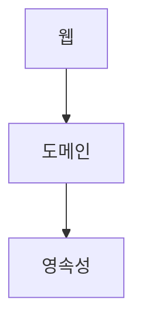
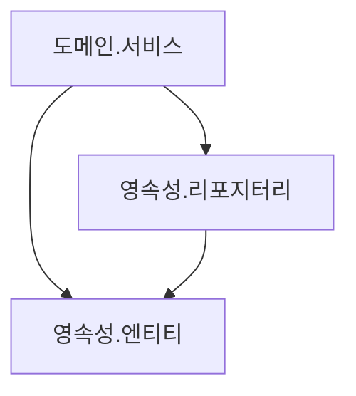
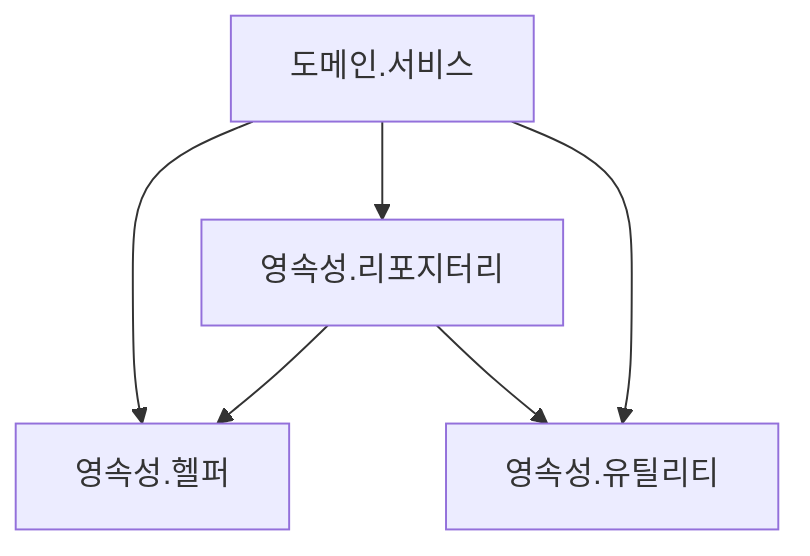
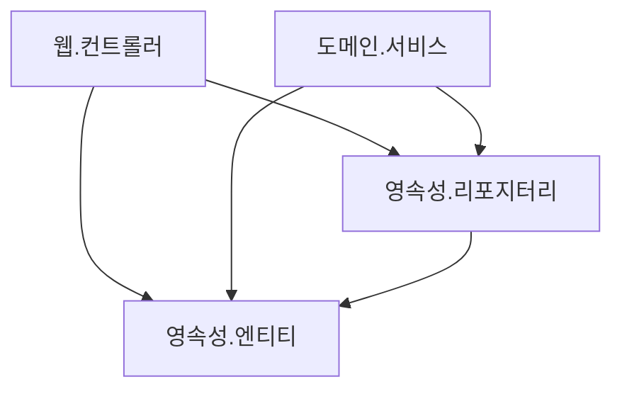
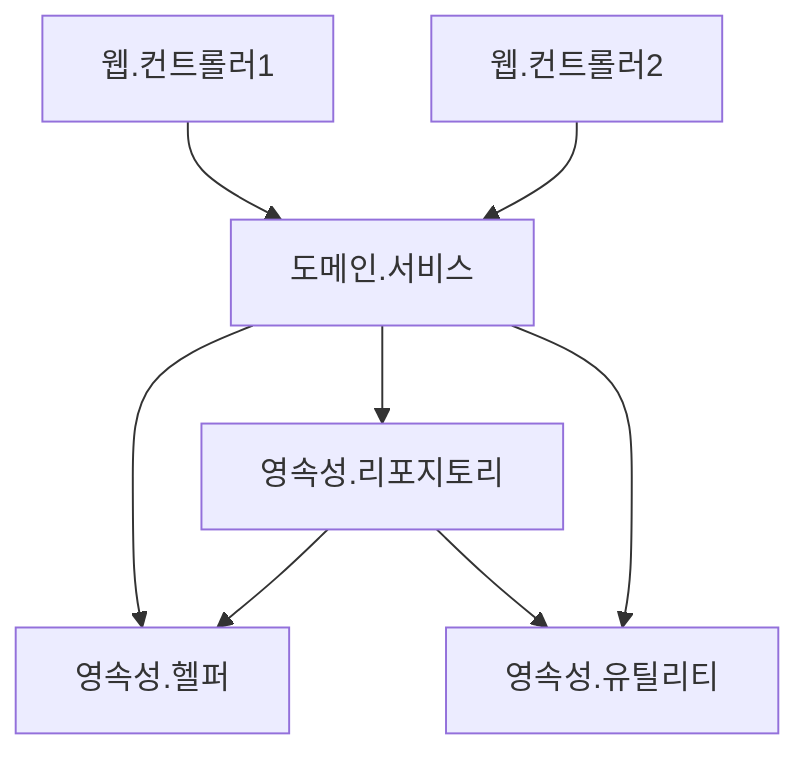
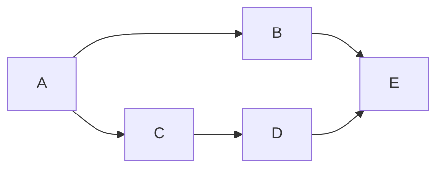
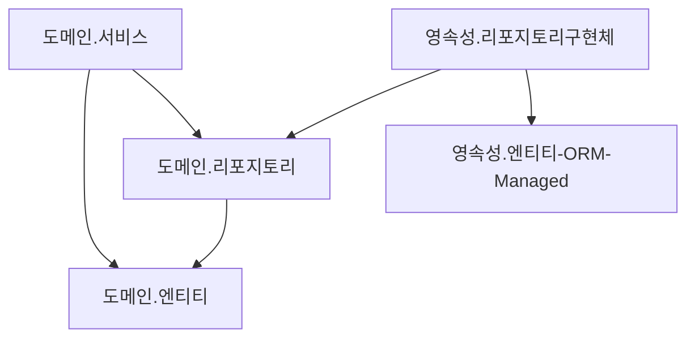

- [1. 계층형 아키텍처의 문제는 무엇일까?](#1-계층형-아키텍처의-문제는-무엇일까)
    - [계층형 아키텍처의 좋은점](#계층형-아키텍처의-좋은점)
    - [계층형 아키텍처의 문제점](#계층형-아키텍처의-문제점)
  - [a. 계층형 아키텍처는 데이터베이스 주도 설계를 유도한다](#a-계층형-아키텍처는-데이터베이스-주도-설계를-유도한다)
    - [모든것이 영속성 계층을 토대로 만들어진다.](#모든것이-영속성-계층을-토대로-만들어진다)
    - [우리가 만드는 애플리케이션의 목적](#우리가-만드는-애플리케이션의-목적)
    - [도메인 로직이 아니라 데이터베이스를 토대로 아키텍처를 만드는 이유](#도메인-로직이-아니라-데이터베이스를-토대로-아키텍처를-만드는-이유)
  - [b. 지름길을 택하기 쉬워진다](#b-지름길을-택하기-쉬워진다)
    - [전통적인 계층형 아키텍처에서는 하나의 규칙만 있다.](#전통적인-계층형-아키텍처에서는-하나의-규칙만-있다)
    - [택하기 쉬운 지름길](#택하기-쉬운-지름길)
    - [지름길을 없애는 방법](#지름길을-없애는-방법)
  - [c. 테스트하기 어려워진다](#c-테스트하기-어려워진다)
    - [계층을 건너 뛰다.](#계층을-건너-뛰다)
    - [계층을 건너 뛰는것의 문제점](#계층을-건너-뛰는것의-문제점)
  - [d. 유스케이스를 숨긴다](#d-유스케이스를-숨긴다)
    - [새로운 유스케이스 조와](#새로운-유스케이스-조와)
    - [계층형 아키텍처의 문제점](#계층형-아키텍처의-문제점-1)
  - [e. 동시 작업이 어려워진다](#e-동시-작업이-어려워진다)
    - [지연되는 소프트웨어 프로젝트에 인력을 더하는 것은 개발을 늦출 뿐이다.](#지연되는-소프트웨어-프로젝트에-인력을-더하는-것은-개발을-늦출-뿐이다)
    - [적절한 규모에서의 인력 추가](#적절한-규모에서의-인력-추가)
    - [계층형 아키텍처의 동시작업](#계층형-아키텍처의-동시작업)
  - [f. 유지보수 가능한 소프트웨어를 만드는 데 어떻게 도움이 될까?](#f-유지보수-가능한-소프트웨어를-만드는-데-어떻게-도움이-될까)
- [2. 의존성 역전하기](#2-의존성-역전하기)
  - [a. 단일 책임 원칙](#a-단일-책임-원칙)
    - [단일 책임 원칙의 오해](#단일-책임-원칙의-오해)
    - [변경할 이유](#변경할-이유)
  - [b. 부수효과에 관한 이야기](#b-부수효과에-관한-이야기)
  - [c. 의존성 역전 원칙](#c-의존성-역전-원칙)
    - [의존성으로 인한 도메인 계층 변경](#의존성으로-인한-도메인-계층-변경)
    - [의존성 역전 원칙](#의존성-역전-원칙)
  - [d. 클린 아키텍처](#d-클린-아키텍처)
  - [e. 육각형 아키텍처(헥사고날 아키텍처)](#e-육각형-아키텍처헥사고날-아키텍처)
  - [f. 유지보수 가능한 소프트웨어를 만드는 데 어떻게 도움이 될까?](#f-유지보수-가능한-소프트웨어를-만드는-데-어떻게-도움이-될까-1)
- [3. 코드 구성하기](#3-코드-구성하기)
  - [a. 계층으로 구성하기](#a-계층으로-구성하기)
  - [b. 기능으로 구성하기](#b-기능으로-구성하기)
  - [c. 아키텍처적으로 표현력 있는 패키지 구조](#c-아키텍처적으로-표현력-있는-패키지-구조)
  - [d. 의존성 주입의 역할](#d-의존성-주입의-역할)
  - [e. 유지보수 가능한 소프트웨어를 만드는 데 어떻게 도움이 될까?](#e-유지보수-가능한-소프트웨어를-만드는-데-어떻게-도움이-될까)
- [4. 유스케이스 구현하기](#4-유스케이스-구현하기)
  - [a. 도메인 모델 구현하기](#a-도메인-모델-구현하기)
  - [b. 유스케이스 둘러보기](#b-유스케이스-둘러보기)
  - [c. 입력 유효성 검증](#c-입력-유효성-검증)
  - [d. 생성자의 힘](#d-생성자의-힘)
  - [e. 유스케이스마다 다른 입력 모델](#e-유스케이스마다-다른-입력-모델)
  - [f. 비즈니스 규칙 검증하기](#f-비즈니스-규칙-검증하기)
  - [g. 풍부한 도메인 모델 vs 빈약한 도메인 모델](#g-풍부한-도메인-모델-vs-빈약한-도메인-모델)
  - [h. 유스케이스마다 다른 출력 모델](#h-유스케이스마다-다른-출력-모델)
  - [i. 읽기 전용 유스케이스는 어떨까?](#i-읽기-전용-유스케이스는-어떨까)
  - [j. 유지보수 가능한 소프트웨어를 만드는 데 어떻게 도움이 될까?](#j-유지보수-가능한-소프트웨어를-만드는-데-어떻게-도움이-될까)
  - [k. 의존성 역전](#k-의존성-역전)
- [5. 웹 어댑터 구현하기](#5-웹-어댑터-구현하기)
  - [a. 웹 어댑터의 책임](#a-웹-어댑터의-책임)
  - [b. 컨트롤러 나누기](#b-컨트롤러-나누기)
  - [c. 유지보수 가능한 소프트웨어를 만드는 데 어떻게 도움이 될까?](#c-유지보수-가능한-소프트웨어를-만드는-데-어떻게-도움이-될까)
  - [d. 의존성 역전](#d-의존성-역전)
- [6. 영속성 어댑터 구현하기](#6-영속성-어댑터-구현하기)
  - [a. 영속성 어댑터의 책임](#a-영속성-어댑터의-책임)
  - [b. 포트 인터페이스 나누기](#b-포트-인터페이스-나누기)
  - [c. 영속성 어댑터 나누기](#c-영속성-어댑터-나누기)
  - [d. 스프링 데이터 JPA 예제](#d-스프링-데이터-jpa-예제)
  - [e. 데이터베이스 트랜잭션은 어떻게 해야 할까?](#e-데이터베이스-트랜잭션은-어떻게-해야-할까)
  - [f. 유지보수 가능한 소프트웨어를 만드는 데 어떻게 도움이 될까?](#f-유지보수-가능한-소프트웨어를-만드는-데-어떻게-도움이-될까-2)
- [7. 아키텍처 요소 테스트하기](#7-아키텍처-요소-테스트하기)
- [8. 경계 간 매핑하기](#8-경계-간-매핑하기)
- [9. 애플리케이션 조립하기](#9-애플리케이션-조립하기)
- [10. 아키텍처 경계 강제하기](#10-아키텍처-경계-강제하기)
- [11. 의식적으로 지름길 상요하기](#11-의식적으로-지름길-상요하기)
- [12. 아키텍처 스타일 결정하기](#12-아키텍처-스타일-결정하기)

# 1. 계층형 아키텍처의 문제는 무엇일까?

- 위의 그림은 일반적인 3계층 아키텍처이다.
- 웹계층
  - 요청을 받아 도메인 or 비즈니스 계층에 있는 서비스로 요청 
- 도메인 혹은 서비스
  - 필요한 비즈니스 로직을 수행하고
  - 도메인 엔티티의 현재 상태를 조회하거나 변경하기 위해 영속성 계층의 컴포넌트를 호출 

### 계층형 아키텍처의 좋은점 
- 계층을 잘 이해하고 구성한다면 웹계층이나 영속성 계층에 독립적으로 도메인 로직을 작성할 수 있다.
- 도메인 로직에 영향을 주지 않고 웹 계층과 영속성 계층에 사용된 기술을 변경할 수 있다.
- 기존 기능에 영향을 주지 않고 새로운 기능을 추가할 수 있다. 
- 잘 만들면 선택의 폭을 넓히고, 변화하는 요구사항과 외부 요인에 빠르게 적응할 수 있다. 

### 계층형 아키텍처의 문제점 
- 코드에 나쁜 습관들이 스며들기 쉽다.
- 시간이 지날수록 소프트웨어를 점점 더 변경하기 어렵게 만드는 많은 허점들을 노출한다.

## a. 계층형 아키텍처는 데이터베이스 주도 설계를 유도한다

### 모든것이 영속성 계층을 토대로 만들어진다.
- 전통적인 계층형 아키텍처의 토대는 DB이다.
- 웹 계층은 도메인 계층에 의존하고, 도메인 계층은 영속성 계층에 의존하기 때문에 자연스럽게 데이터베이스에 의존한다.

### 우리가 만드는 애플리케이션의 목적 
- 비즈니스를 관장하는 규칙이나 정책을 반영한 모델을 만들어서 사용자가 이러한 규칙과 정책을 더욱 편리하게 활용할 수 있게 한다. 
- 상태(state)가 아니라 행동(behavior)을 중심으로 모델링한다.
- 행동이 상태를 바꾸는 주체이기 때문에 행동이 비즈니스를 이끌어간다. 

### 도메인 로직이 아니라 데이터베이스를 토대로 아키텍처를 만드는 이유 
- 계층형 아키텍처에서는 의존성 방향에 따라 자연스럽게 데이터베이스의 구조를 먼저 생각하고, 이를 토대로 도메인 로직을 구현한다.
  - 이 구현 방법은 비즈니스 관점에서는 맞지 않는 방법이다.
  - 도메인 로직을 먼저 만들고, 로직을 제대로 이해 했는지 확인한 후에 이를 기반으로 영속성 계층과 웹 계층을 만들어야 한다.
- 가장 큰 이유는, ORM 프레임워크를 사용하기 때문이다.
  - 계층형 + ORM 프레임워크 결합은 비즈니스 규칙을 영속성 관점과 섞고 싶은 유혹을 쉽게 받는다.

- ORM에 의해 관리되는 엔티티들은 일반적으로 영속성 계층에 둔다.
  - 계층은 아래방향으로만 접근 가능하기 때문에 도메인 계층에서는 이러한 엔티티에 접근할 수 있다.
  - 그리고, 이러한 엔티티에 접근할 수 있다면 분명 사용되기 마련이다.
- 하지만, 이렇게 구성되면 영속성 계층과 도메인 계층 사이에 강한 결합이 생긴다.
  - 서비스는 영속성 모델을 비즈니스 모델처럼 사용하게 되고 
  - 이로 인해 도메인 로직 뿐만 아니라 즉시 로딩/지연 로딩, 데이터베이스 트랜잭션, 캐시 플러시 등 영속성 계층과 관련된 작업들을 해야 한다. 
- 영속성 코드가 사실상 도메인 코드에 녹아들어서 둘 중 하나만 바꾸는 것이 어려워 진다.
  - 유연하고 선택의 폭을 넓혀준다던 계층형 아키텍처의 목표와 정확히 반대되는 상황이다.

## b. 지름길을 택하기 쉬워진다

### 전통적인 계층형 아키텍처에서는 하나의 규칙만 있다.
- 특정 계층에서 같은 계층 또는 아래에 있는 계층에만 접근 가능하다.
- 위의 규칙 이외에는 아키텍처에서의 강제성은 없다.

### 택하기 쉬운 지름길
- 상위 계층에 접근해야 하는 경우, 그 컴포넌트를 내리면 그만이다.
- 한번이 어렵지, 유혹을 뿌리치기가 쉽지 않다.

- 영속성 계층에서는 모든 것에 접근이 가능하기 떄문에 시간이 지나면서 점점 비대해진다.
- 수년에 걸친 개발과 유지보수로 결국 위의 그림으로 될 확률이 높다.

### 지름길을 없애는 방법 
- 규칙이 깨졌을 때 빌드가 실패하도록 만드는 규칙이 필요하다.
- 위와 같은 규칙이 없다면 계층형 아키텍처는 최선의 선택이 아니다. 
- 시니어 개발자가 코드 리뷰를 한다고 해도 의미는 없다. 

## c. 테스트하기 어려워진다

### 계층을 건너 뛰다.
- 엔티티의 필드를 단 하나만 조작하면 되는 경우에 웹 계층에서 바로 영속성 계층에 접근하면 도메인 계층을 건드릴 필요가 없지 않을까? 란 생각이 종종 든다.

- 처음 몇번은 괜찮게 느껴지지만, 이런일이 자주 발생하면 두가지 문제점이 생긴다.

### 계층을 건너 뛰는것의 문제점 
1. 단하나의 필드를 조작하는 것에 불과 하더라도 도메인 로직을 웹 계층에 구현하게 된다. 
   - 만약 유스케이스가 확장된다면 어떻게 될까? 
   - 더 많은 도메인 로직을 웹 계층에 추가해서 어플리케이션 전반에 걸쳐 책임이 섞이고 핵심 도메인 로직들이 퍼져나갈 확률이 높다 
2. 웹 계층 테스트에서 도메인 계층뿐만 아니라 영속성 계층도 모킹해야 한다.
   - 테스트의 복잡도가 올라간다.
   - 테스트 설정이 복잡해짐으로써 테스트를 전혀 작성하지 않는 방향으로 가는 첫 걸음이다. (복잡한 설정을 할 시간이 없기 떄문)
   - 컴포넌트의 규모가 커지면 테스트 코드를 작성하는 것보다 종속성을 이해하고 목을 만드는데 더 많은 시간이 걸린다. 

## d. 유스케이스를 숨긴다

### 새로운 유스케이스 조와
- 개발자들은 새로운 유스케이스를 구현하는 새로운 코드를 짜는 것을 좋아한다.
- 그러나, 실제로는 기존 코드를 바꾸는 데 더 많은 시간을 쓴다.
- 레거시 프로젝트에만 해당 되는 것이 아니라, 신규 프로젝트에서도 해당이 되는 이야기이다.
- 기능을 추가하거나 변경할 적절한 위치를 찾는일이 많기 떄문에 아키텍처는 코드를 빠르게 탐색하는데 도움이 돼야 한다.
- 이런 관점에서 계층형 아키텍처의 문제는 무엇일까?

### 계층형 아키텍처의 문제점
- 계층형 아키텍처는 도메인 로직이 여러 계층에 걸쳐 흩어지기 쉽다.
  - 유스케이스가 간단해서 도메인 계층을 생략한다면 웹 계층에 존재할 수도 있고,
  - 도메인 계층과 영속성 계층 모두에서 접근할 수 있도록 특정 컴포넌트를 아래로 내렸다면 영속성 계층에 존재할 수도 있다
  - 이럴 경우 새로운 기능을 추가할 적당한 위치를 찾는 일은 이미 어려워 진다.

- 계층형 아키텍처는 도메인 서비스의 너비에 관한 규칙을 강제하지 않는다.
  - 시간이 지날수록 여러개의 유스케이스를 담당하는 아주 넓은 도메인 서비스가 만들어지기도 한다
  - 넓은 서비스는 영속성 계층에 많은 의존성을 갖게 되고, 다시 웹 레이어의 많은 컴포넌트가 이 서비스에 의존하게 된다.
  - 그럼 서비스를 테스트하기도 어려워지고 작업해야 할 유스케이스를 책임지는 서비스를 찾기도 어려워진다.
- 고도로 특화된 좁은 도메인 서비스가 유스케이스 하나씩만 담당하게 된다면 어떨까?
  - UserService에서 사용자 등록 유스케이스를 찾는 대신 
  - RegisterUserService를 바로 열어서 작업을 시작하면 유스케이스를 책임지는 서비스를 찾기가 수월해진다.

## e. 동시 작업이 어려워진다

### 지연되는 소프트웨어 프로젝트에 인력을 더하는 것은 개발을 늦출 뿐이다.
- 지연되지 않은 소프트웨어 프로젝트에 대해서도 마찬가지다.
- 모든 상황에서 50명 정도의 큰 규모의 개발팀이 10명 정도 되는 작은 규모의 개발 팀 보다 5배 빠를거라고 기대할 수 없다.
- 여러 하위팀으로 쪼개서 각기 분리된 파트를 개발할 수 있는 아주 규모가 큰 애플리케이션을 만들고 있다면 그럴 수도 있지만, 대부분은 서로 도움을 주고 받으며 개발해야 한다

### 적절한 규모에서의 인력 추가
- 적절한 규모에서는 프로젝트에 인원이 더 투입될 경우 확실히 더 빨라지지만, 이것도 아키텍처가 동시 작업을 지원해야 한다.
- 그 아키텍처가 계층형 아키텍처는 아니다.

### 계층형 아키텍처의 동시작업
- 새로운 유스케이스를 추가할 때 
  - 개발자가 3명이 있다.
  - 한명은 웹 계층, 한명은 도메인 계층, 한명은 영속성 계층에 기능을 추가한다고 상상해보자.
- 계층형 아키텍처에서는 하나의 유스케이스를 동시작업을 할 수 없다.
  - 모든 것이 영속성 게층 위에 만들어지기 떄문에 영속성 계층을 먼저 개발해야 하고, 그다음 도메인 계층, 그다음 웹계층을 만들어야 한다.
  - 그렇기 때문에 특정 기능은 동시에 한명의 개발자만 작업할 수 있다.
- 인터페이스를 먼저 같이 정의하고, 구현을 기다릴 필요 없이 인터페이스로 작업하면 될까?
  - 데이터베이스 주도 설계를 하지 않는 경우에만 가능하다.
  - 데이터베이스 주도 설계는 영속성 로직이 도메인 로직과 뒤섞여서 각 측면을 개별적으로 작업할 수 없다
- 코드에 넓은 서비스가 있다면 서로 다른 기능을 동시에 작업하기가 더욱 어렵다
  - 서로 다른 유스케이스에 대한 작업을 하게 되면 같은 서비스를 동시에 편집하는 상황이 발생하고, 
  - 이는 병합 충돌과 잠재적으로 이전 코드로 되돌려야 하는 문제가 생긴다.

## f. 유지보수 가능한 소프트웨어를 만드는 데 어떻게 도움이 될까? 
- 올바르게 구축하고 몇 가지 추가적인 규칙들을 적용하면 계층형 아키텍처는 유지보수에 적합할 수 있다.
- 하지만, 많은 것들이 잘못된 방향으로 흘러가도록 용인한다.
- 아주 엄격한 자기 훈련 없이는 시간이 지날수록 품질이 저하되고 유지보수하기가 어려워지기 쉽다
- 어느 아키텍처로 만들던, 게층형 아키텍처의 함정을 염두에 두고 지름길을 택하지 않으면 유지보수하기 적합한 소프트웨어가 만들어질 수 있다.

# 2. 의존성 역전하기

- 1장에서는 계층형 아키텍처의 단점만 늘어놓았고, 이번엔 대안에 대해서 이야기 해보자.

## a. 단일 책임 원칙

### 단일 책임 원칙의 오해
- `단일 책임의 원칙하나의 컴포넌트는 오로지 한 가지 일만 해야 하고, 그것을 올바르게 수행해야 한다`
- 위의 해석은 단일 책임이라는 말을 가장 직관적으로 해석한것이고, 실제 정의는 아래와 같다.
- `컴포넌트를 변경하는 이유는 오직 하나뿐이어야 한다.`
- 컴포넌트를 변경할 이유가 한 가지라면 다른 이유로 소프트웨어를 변경하더라도 이 컴포넌트에 대해서는 신경쓸 필요가 없어진다.

### 변경할 이유 
- 변경할 이유는 컴포넌트 간의 의존성을 통해 쉽게 전파된다.

- 위 그림에서는 A -> E, A -> D 는 직접적으로 연결되진 않았지만, 간접적으로 의존하고 있고 이것을 전이 의존성이라고 한다.
- 컴포넌트 A는 다른 컴포넌트에 모두 의존하고 있지만, E는 의존하는것이 전혀 없다.
- 컴포넌트 E를 변경할 유일한 이유는 새로운 요구사항에 의해 E의 기능을 바꿔야 할 때 뿐이다.
- 반면 컴포넌트 A의 경우에는 모든 컴포넌트에 의존하고 있기 때문에 다른 어떤 컴포넌트가 바뀌든지 같이 바뀌어야 한다.
- 많은 코드가 단일 책임 원칙을 위반하기 때문에 시간이 갈수록 변경하기가 더 어려워지고 변경 비용도 증가한다.
  - 시간이 갈수록 컴포넌트를 변경할 이유가 더 많아진다.
  - 변경할 이유가 많아지면 한 컴포넌트를 바꾸는 것이 다른 컴포넌트가 실패하는 원인으로 작용할 수 있다. 

## b. 부수효과에 관한 이야기

저자님의 에피소드 

- 다른 소프트웨어 회사에서 개발한 10년 된 코드를 받아서 진행하는 프로젝트에 참여한적이 있었다.
- 예상했던 대로 코드가 실제로 어떤 일을 하는지를 이해하기가 쉽지 않았고, 코드의 한 영역을 변경했더니 다른 영역에서 부수효과가 생겨났었다.
  - 하지만 철저하게 테스트하고 자동화된 테스트를 추가하고 리팩터링을 많이해서 어찌저찌 해나갔다.
- 코드를 성공적으로 유지보수하고 확장한 후, 클라이언트는 이 소프트웨어의 사용자 입장에서 굉장히 이상한 방식으로 동작하는 새로운 기능을 구현해 달라고 요청했다.
  - 그래서 저자는 조금 더 사용자 친화적이면서도 전반적인 변경이 더 적어 구현하는 비용도 더 저렴한 방식을 제안했다.
  - 하지만, 이는 아주 핵심적인 특정 컴포넌트를 변경해야 하는 작업이었다.
- 클라이언트는 필자의 제안을 거절했고, 더 이상하고 비용이 많이 드는 방식을 주문했다.
  - 그 이유를들어보니, 이전 개발팀에서 과거에 그 컴포넌트를 변경했을 때 언제나 다른 무언가가 망가졌기 때문에 변경에 대한 부수효과를 우려했던 것이다.
- 안타깝게도 이 사례는 클라이언트로 하여금 잘못 구조화된 소프트웨어를 변경하는 데 더 많은 비용을 지불하도록 만드는 경우를 보여준다.
  - 다행히 대부분의 클라이언트는 이런식으로 대응하지 않을 것이다.
  - 그러니 이러한 방식 대신 좋은 소프트웨어를 만들도록 노력해보자.

## c. 의존성 역전 원칙

### 의존성으로 인한 도메인 계층 변경
- 계층형 아키텍처는 항상 다음 계층인 아래방향으로 의존한다.
  - 단일 책임 원칙을 고수준에서 적용할 때 하위계층보다 상위계층이 변경할 이유가 많다.
- 영속성 계층을 변경할 때마다 도메인 계층도 변경해야 한다.
  - 도메인 계층은 애플리케이션에서 가장 중요한 코드이므로 영속성 코드가 바뀐다고 해서 도메인 코드까지 바꾸고 싶지 않다.
- 이 의존성을 어떻게 제거 할까? 

### 의존성 역전 원칙 
`코드상의 어떤 의존성이든 그 방향을 바꿀 수(역전시킬 수)있다`
- 사실 의존성의 양쪼 코드를 모두 제어할 수 있을 때만 의존성을 역전시킬 수 없다.
  - 만약, 서드파티 라이브러리에 의존성이 있다면 해당 라이브러리를 제어할 수 없기 때문에 이 의존성은 역전할 수 없다.
- 도메인 코드와 영속성 코드 간의 의존성을 역전시켜서 영속성 코드가 도메인 코드에 의존하고, 도메인 코드의 `변경할 이유`의 개수를 줄여보자.
- 엔티티는 도메인 객체를 표현하고 도메인 코드는 이 엔티티들의 상태를 변경하는 일을 중심으로 하기 때문에 먼저 엔티티를 도메인 계층으로 올린다.
- 그러나 영속성 계층의 리포지토리가 도메인 계층에 있는 엔티티에 의존하기 때문에 두 계층 사이에 순환 의존성이 생긴다.
  - 이부분이 바로 DIP를 적용하는 부분이다.
  - 도메인 계층에 리포지토리에 대한 인터페이스를 만들고
  - 실제 리포지토리는 영속성 계층에서 구현한다.

- 영속성 코드에 있는 숨막히는 의존성으로부터 도메인 로직을 해방시켰다.
- 이것이 바로 다음 절에서 살펴볼 두 가지 아키텍처 스타일의 핵심 기능이다.

## d. 클린 아키텍처

## e. 육각형 아키텍처(헥사고날 아키텍처)

## f. 유지보수 가능한 소프트웨어를 만드는 데 어떻게 도움이 될까? 

# 3. 코드 구성하기 

## a. 계층으로 구성하기

## b. 기능으로 구성하기

## c. 아키텍처적으로 표현력 있는 패키지 구조

## d. 의존성 주입의 역할

## e. 유지보수 가능한 소프트웨어를 만드는 데 어떻게 도움이 될까? 

# 4. 유스케이스 구현하기

## a. 도메인 모델 구현하기 

## b. 유스케이스 둘러보기

## c. 입력 유효성 검증

## d. 생성자의 힘

## e. 유스케이스마다 다른 입력 모델

## f. 비즈니스 규칙 검증하기

## g. 풍부한 도메인 모델 vs 빈약한 도메인 모델

## h. 유스케이스마다 다른 출력 모델 

## i. 읽기 전용 유스케이스는 어떨까?

## j. 유지보수 가능한 소프트웨어를 만드는 데 어떻게 도움이 될까? 

## k. 의존성 역전
 

# 5. 웹 어댑터 구현하기

## a. 웹 어댑터의 책임

## b. 컨트롤러 나누기

## c. 유지보수 가능한 소프트웨어를 만드는 데 어떻게 도움이 될까? 

## d. 의존성 역전

# 6. 영속성 어댑터 구현하기 

## a. 영속성 어댑터의 책임

## b. 포트 인터페이스 나누기

## c. 영속성 어댑터 나누기

## d. 스프링 데이터 JPA 예제

## e. 데이터베이스 트랜잭션은 어떻게 해야 할까?

## f. 유지보수 가능한 소프트웨어를 만드는 데 어떻게 도움이 될까? 

# 7. 아키텍처 요소 테스트하기

# 8. 경계 간 매핑하기

# 9. 애플리케이션 조립하기

# 10. 아키텍처 경계 강제하기

# 11. 의식적으로 지름길 상요하기

# 12. 아키텍처 스타일 결정하기
