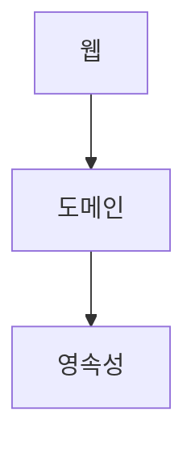

- [1. 계층형 아키텍처의 문제는 무엇일까?](#1-계층형-아키텍처의-문제는-무엇일까)
    - [계층형 아키텍처의 좋은점](#계층형-아키텍처의-좋은점)
    - [계층형 아키텍처의 문제점](#계층형-아키텍처의-문제점)
  - [a. 계층형 아키텍처는 데이터베이스 주도 설계를 유도한다](#a-계층형-아키텍처는-데이터베이스-주도-설계를-유도한다)
  - [b. 지름길을 택하기 쉬워진다](#b-지름길을-택하기-쉬워진다)
  - [c. 테스트하기 어려워진다](#c-테스트하기-어려워진다)
  - [d. 유스케이스를 숨긴다](#d-유스케이스를-숨긴다)
  - [e. 동시 작업이 어려워진다](#e-동시-작업이-어려워진다)
  - [f. 유지보수 가능한 소프트웨어를 만드는 데 어떻게 도움이 될까?](#f-유지보수-가능한-소프트웨어를-만드는-데-어떻게-도움이-될까)
- [2. 의존성 역전하기](#2-의존성-역전하기)
  - [a. 단일 책임 원칙](#a-단일-책임-원칙)
  - [b. 부수효과에 관한 이야기](#b-부수효과에-관한-이야기)
  - [c. 의존성 역전 원칙](#c-의존성-역전-원칙)
  - [d. 클린 아키텍처](#d-클린-아키텍처)
  - [e. 육각형 아키텍처(헥사고날 아키텍처)](#e-육각형-아키텍처헥사고날-아키텍처)
  - [f. 유지보수 가능한 소프트웨어를 만드는 데 어떻게 도움이 될까?](#f-유지보수-가능한-소프트웨어를-만드는-데-어떻게-도움이-될까-1)
- [3. 코드 구성하기](#3-코드-구성하기)
  - [a. 계층으로 구성하기](#a-계층으로-구성하기)
  - [b. 기능으로 구성하기](#b-기능으로-구성하기)
  - [c. 아키텍처적으로 표현력 있는 패키지 구조](#c-아키텍처적으로-표현력-있는-패키지-구조)
  - [d. 의존성 주입의 역할](#d-의존성-주입의-역할)
  - [e. 유지보수 가능한 소프트웨어를 만드는 데 어떻게 도움이 될까?](#e-유지보수-가능한-소프트웨어를-만드는-데-어떻게-도움이-될까)
- [4. 유스케이스 구현하기](#4-유스케이스-구현하기)
  - [a. 도메인 모델 구현하기](#a-도메인-모델-구현하기)
  - [b. 유스케이스 둘러보기](#b-유스케이스-둘러보기)
  - [c. 입력 유효성 검증](#c-입력-유효성-검증)
  - [d. 생성자의 힘](#d-생성자의-힘)
  - [e. 유스케이스마다 다른 입력 모델](#e-유스케이스마다-다른-입력-모델)
  - [f. 비즈니스 규칙 검증하기](#f-비즈니스-규칙-검증하기)
  - [g. 풍부한 도메인 모델 vs 빈약한 도메인 모델](#g-풍부한-도메인-모델-vs-빈약한-도메인-모델)
  - [h. 유스케이스마다 다른 출력 모델](#h-유스케이스마다-다른-출력-모델)
  - [i. 읽기 전용 유스케이스는 어떨까?](#i-읽기-전용-유스케이스는-어떨까)
  - [j. 유지보수 가능한 소프트웨어를 만드는 데 어떻게 도움이 될까?](#j-유지보수-가능한-소프트웨어를-만드는-데-어떻게-도움이-될까)
  - [k. 의존성 역전](#k-의존성-역전)
- [5. 웹 어댑터 구현하기](#5-웹-어댑터-구현하기)
  - [a. 웹 어댑터의 책임](#a-웹-어댑터의-책임)
  - [b. 컨트롤러 나누기](#b-컨트롤러-나누기)
  - [c. 유지보수 가능한 소프트웨어를 만드는 데 어떻게 도움이 될까?](#c-유지보수-가능한-소프트웨어를-만드는-데-어떻게-도움이-될까)
  - [d. 의존성 역전](#d-의존성-역전)
- [6. 영속성 어댑터 구현하기](#6-영속성-어댑터-구현하기)
  - [a. 영속성 어댑터의 책임](#a-영속성-어댑터의-책임)
  - [b. 포트 인터페이스 나누기](#b-포트-인터페이스-나누기)
  - [c. 영속성 어댑터 나누기](#c-영속성-어댑터-나누기)
  - [d. 스프링 데이터 JPA 예제](#d-스프링-데이터-jpa-예제)
  - [e. 데이터베이스 트랜잭션은 어떻게 해야 할까?](#e-데이터베이스-트랜잭션은-어떻게-해야-할까)
  - [f. 유지보수 가능한 소프트웨어를 만드는 데 어떻게 도움이 될까?](#f-유지보수-가능한-소프트웨어를-만드는-데-어떻게-도움이-될까-2)
- [7. 아키텍처 요소 테스트하기](#7-아키텍처-요소-테스트하기)
- [8. 경계 간 매핑하기](#8-경계-간-매핑하기)
- [9. 애플리케이션 조립하기](#9-애플리케이션-조립하기)
- [10. 아키텍처 경계 강제하기](#10-아키텍처-경계-강제하기)
- [11. 의식적으로 지름길 상요하기](#11-의식적으로-지름길-상요하기)
- [12. 아키텍처 스타일 결정하기](#12-아키텍처-스타일-결정하기)

# 1. 계층형 아키텍처의 문제는 무엇일까?

- 위의 그림은 일반적인 3계층 아키텍처이다.
- 웹계층
  - 요청을 받아 도메인 or 비즈니스 계층에 있는 서비스로 요청 
- 도메인 혹은 서비스
  - 필요한 비즈니스 로직을 수행하고
  - 도메인 엔티티의 현재 상태를 조회하거나 변경하기 위해 영속성 계층의 컴포넌트를 호출 

### 계층형 아키텍처의 좋은점 
- 계층을 잘 이해하고 구성한다면 웹계층이나 영속성 계층에 독립적으로 도메인 로직을 작성할 수 있다.
- 도메인 로직에 영향을 주지 않고 웹 계층과 영속성 계층에 사용된 기술을 변경할 수 있다.
- 기존 기능에 영향을 주지 않고 새로운 기능을 추가할 수 있다. 
- 잘 만들면 선택의 폭을 넓히고, 변화하는 요구사항과 외부 요인에 빠르게 적응할 수 있다. 

### 계층형 아키텍처의 문제점 
- 코드에 나쁜 습관들이 스며들기 쉽다.
- 시간이 지날수록 소프트웨어를 점점 더 변경하기 어렵게 만드는 많은 허점들을 노출한다.

## a. 계층형 아키텍처는 데이터베이스 주도 설계를 유도한다

## b. 지름길을 택하기 쉬워진다

## c. 테스트하기 어려워진다

## d. 유스케이스를 숨긴다

## e. 동시 작업이 어려워진다

## f. 유지보수 가능한 소프트웨어를 만드는 데 어떻게 도움이 될까? 

# 2. 의존성 역전하기

## a. 단일 책임 원칙

## b. 부수효과에 관한 이야기

## c. 의존성 역전 원칙

## d. 클린 아키텍처

## e. 육각형 아키텍처(헥사고날 아키텍처)

## f. 유지보수 가능한 소프트웨어를 만드는 데 어떻게 도움이 될까? 

# 3. 코드 구성하기 

## a. 계층으로 구성하기

## b. 기능으로 구성하기

## c. 아키텍처적으로 표현력 있는 패키지 구조

## d. 의존성 주입의 역할

## e. 유지보수 가능한 소프트웨어를 만드는 데 어떻게 도움이 될까? 

# 4. 유스케이스 구현하기

## a. 도메인 모델 구현하기 

## b. 유스케이스 둘러보기

## c. 입력 유효성 검증

## d. 생성자의 힘

## e. 유스케이스마다 다른 입력 모델

## f. 비즈니스 규칙 검증하기

## g. 풍부한 도메인 모델 vs 빈약한 도메인 모델

## h. 유스케이스마다 다른 출력 모델 

## i. 읽기 전용 유스케이스는 어떨까?

## j. 유지보수 가능한 소프트웨어를 만드는 데 어떻게 도움이 될까? 

## k. 의존성 역전
 

# 5. 웹 어댑터 구현하기

## a. 웹 어댑터의 책임

## b. 컨트롤러 나누기

## c. 유지보수 가능한 소프트웨어를 만드는 데 어떻게 도움이 될까? 

## d. 의존성 역전

# 6. 영속성 어댑터 구현하기 

## a. 영속성 어댑터의 책임

## b. 포트 인터페이스 나누기

## c. 영속성 어댑터 나누기

## d. 스프링 데이터 JPA 예제

## e. 데이터베이스 트랜잭션은 어떻게 해야 할까?

## f. 유지보수 가능한 소프트웨어를 만드는 데 어떻게 도움이 될까? 

# 7. 아키텍처 요소 테스트하기

# 8. 경계 간 매핑하기

# 9. 애플리케이션 조립하기

# 10. 아키텍처 경계 강제하기

# 11. 의식적으로 지름길 상요하기

# 12. 아키텍처 스타일 결정하기
